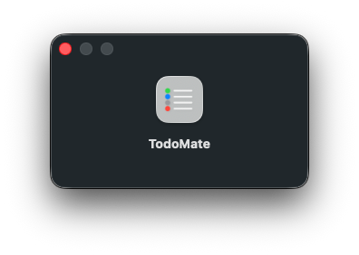
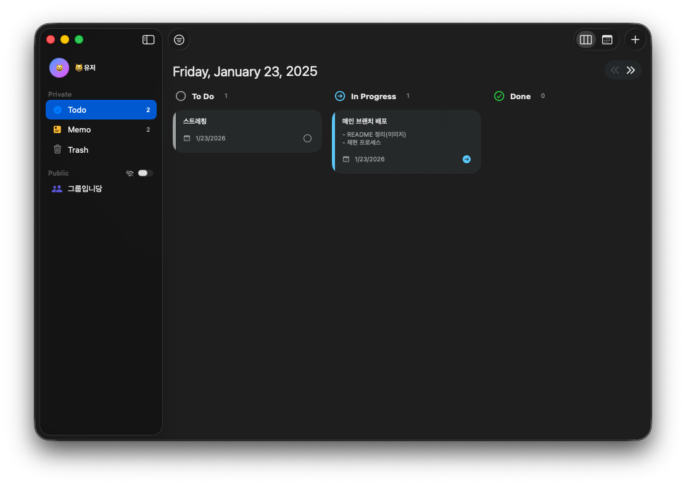
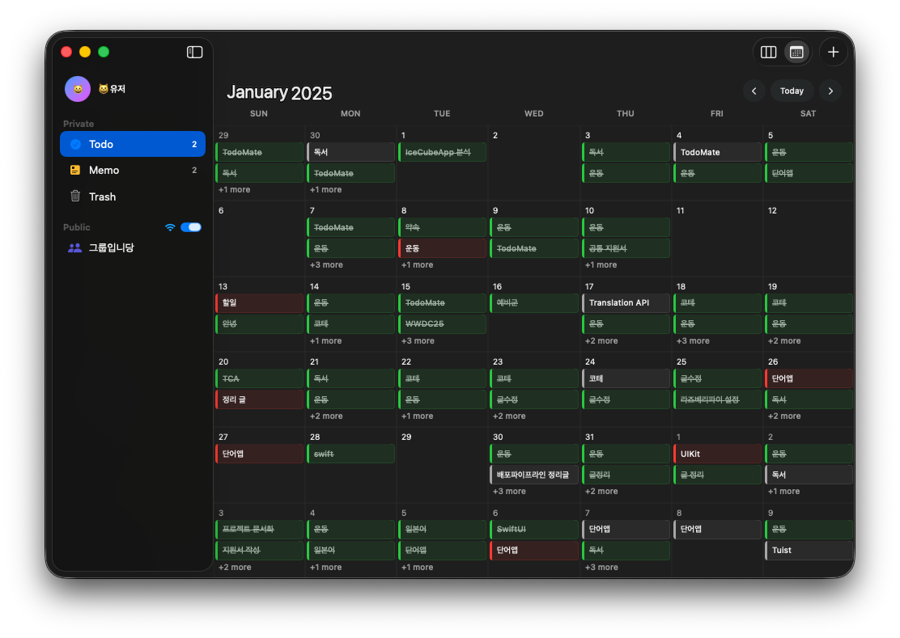
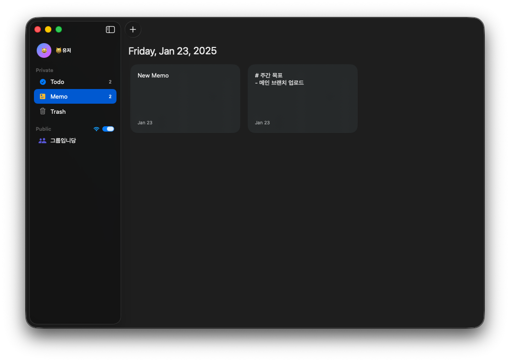
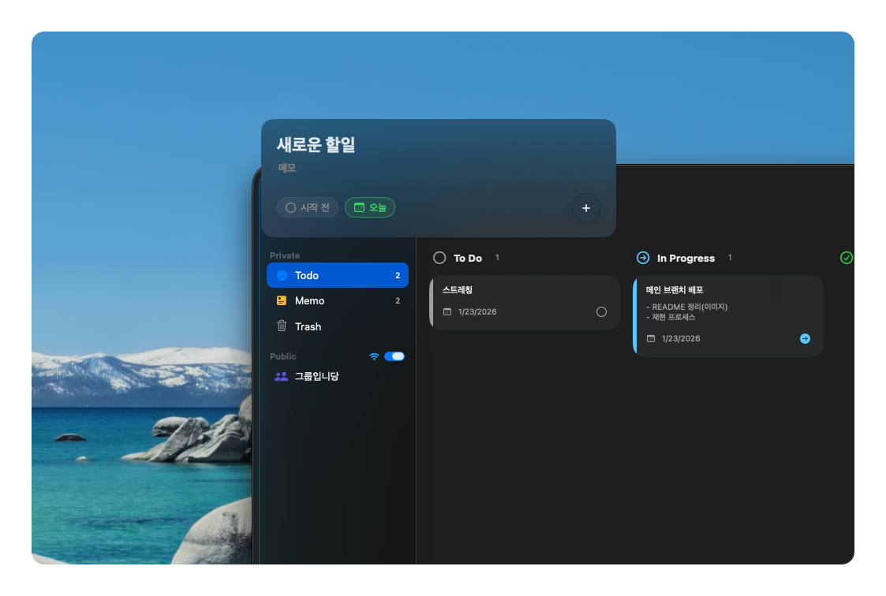
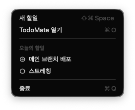
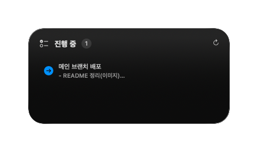
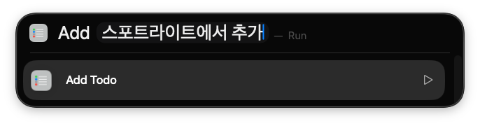
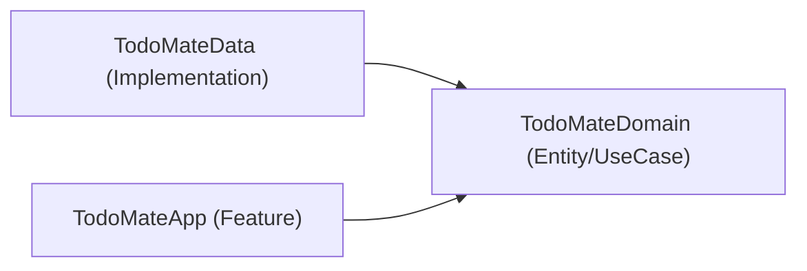
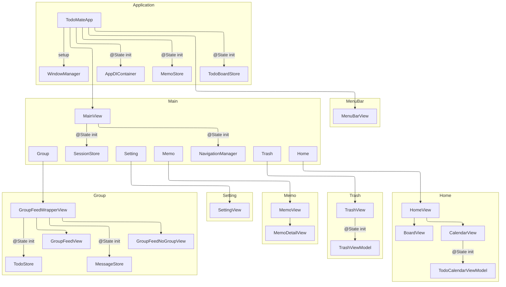

# TodoMate

**TodoMate**는 현재 개인 할 일·메모 플래너에서 Todo·Memo·다중 Chat을 한 Project에 모으는
local-first macOS workspace로 재구성 중입니다.

> [!NOTE]
> 아래 화면과 구조는 현재 legacy 구현을 설명합니다. 목표 제품은 개인/공유를 하나의
> Project lifecycle로 통합하고 선택 Project 안에서 Todo·Memo·다중 Chat Channel을 사용하는
> [Project-first Full Mock Client MVP](https://linear.app/hot6/document/todomate-project-first-full-mock-client-mvp-f46148c475f5)입니다.
> 현재 구현과 목표 경계는 [`docs/app-architecture.md`](docs/app-architecture.md)를 참고하세요.

*현재 다음과 같이 최소한의 기능들로 구현되어있으며, 향후 지속적인 고도화 및 기능 업데이트가 진행될 예정입니다.*

## 주요 기능

### Kanban 보드
필터를 통해 지금 당장 집중해야 할 일들을 직관적으로 관리합니다.

 

### 캘린더
월간 일정 뷰를 제공하여 장기적인 계획과 할 일을 한눈에 쉽게 파악하고 관리합니다.

 

### 메모 관리
단순한 할 일을 넘어, 떠오르는 아이디어나 중요한 정보를 간단하게 정리하고 기록할 수 있습니다.

 

### 퀵 오버레이
어디서나 단축키(`⇧⌘Space`) 하나로 즉시 할 일 목록에 추가할 수 있습니다.

 

### 메뉴바
상단 메뉴바를 통해 앱을 열지 않고도 언제 어디서나 할 일을 빠르게 확인하고 완료할 수 있습니다.

 

### 위젯
데스크탑 위젯을 통해 홈 화면에서 나의 할 일 목록을 한눈에 파악할 수 있습니다.

 

### 앱인텐트 & 단축어
Siri와 단축어 앱을 연동하여 나만의 자동화된 생산성 워크플로우를 구성할 수 있습니다.

### 기타
- **그룹 활동**: 그룹 피드를 통해 친구들과 오늘 한 일을 공유하고, 실시간 채팅으로 가볍게 소통할 수 있습니다.
- **온/오프라인 모드 분리**: 개인 작업은 오프라인에서도 제약 없이 수행하고, 그룹 활동이 필요할 때만 온라인으로 연결하여 그룹 관련 기능을 사용할 수 있습니다.
- **자동 업데이트**: 별도의 수동 다운로드 없이 앱 내에서 업데이트를 시킬 수 있습니다.

## 개발자 참고사항

이 프로젝트는 개발 편의성과 유지보수를 위해 **모듈화 아키텍처**와 **명시적인 의존성 주입** 전략을 채택하고 있습니다.

### 모듈화
Swift Package Manager를 활용하여 각 계층(Layer)을 독립적인 패키지로 분리했습니다.

 

- **TodoMateApp**: SwiftUI View와 @Observable 객체들이 위치하며, 사용자 상호작용을 처리합니다.
- **TodoMateDomain**: 엔티티, 유즈케이스, 레포지토리 인터페이스(Protocol)를 정의합니다. 외부 프레임워크에 의존하지 않고 순수 Swift만 사용합니다.
- **TodoMateData**: 도메인 레이어의 인터페이스를 구현합니다.
- **Common**: 모든 레이어에서 공통으로 사용하는 유틸리티 및 익스텐션입니다.

### 의존성 관리

외부 라이브러리 없이, 직접 구현한 `AppDIContainer`를 통해 앱 전체의 의존성을 관리합니다. 컨테이너는 역할에 따라 두 가지로 구분됩니다.

- **CoreDIContainer**: 앱의 근간이 되는 로컬 기능들이 존재합니다.
- **PublicDIContainer**: 외부와의 연결이 필요한 온라인 기능들이 존재합니다.

### 현재 프레젠테이션 계층 (legacy)

## 기타

### SimpleOverlaySystem
[**SimpleOverlaySystem**](https://github.com/hot666666/SimpleOverlaySystem) 패키지는 SwiftUI의 기본 `sheet`나 `popover` 방식의 제약을 극복하고, macOS 환경에 최적화된 인터랙션을 구현하기 위해 자체 개발한 오버레이 관리 라이브러리입니다.
  - **정밀한 제어**: 특정 뷰를 기준으로 한 상대적 위치 배치 및 정밀한 크기 조정을 지원합니다.
  - **스택 기반 관리**: 여러 오버레이를 스택 구조로 관리하여 복잡한 UI 흐름(Flow)을 체계적으로 제어할 수 있습니다.
  - **확장성**: 단순 `ZStack`이나 `overlay`보다 구조화된 방식으로 화면 전체 또는 특정 영역에 대한 오버레이 시스템을 구축합니다.

### justfile

`just` 커맨드 러너를 통해 다음과 같은 주요 워크플로우를 지원합니다:

- **빌드 및 테스트**: `just build`, `just test-all` 명령어로 전체 프로젝트 빌드와 유닛/통합 테스트를 수행합니다.
- **통합 테스트 환경**: `just start-emulator`를 통해 Firebase 로컬 에뮬레이터를 실행합니다. 이를 통해 실제 프로덕션 데이터와 격리된 환경에서 안전하게 기능을 검증할 수 있습니다.
- **UI 스크린샷**: `just ui-screenshots`를 실행하면 자동화된 스크립트가 사전 등록된 주요 화면들로 진입하여 UI 스크린샷 캡처를 수행합니다.

## 참고
- Agent Rules: https://github.com/twostraws/SwiftAgents
- Agent Skills: https://github.com/Dimillian/Skills
