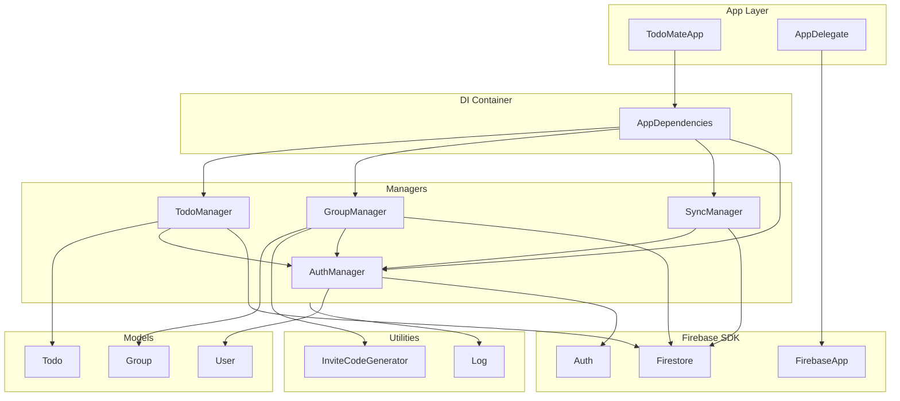
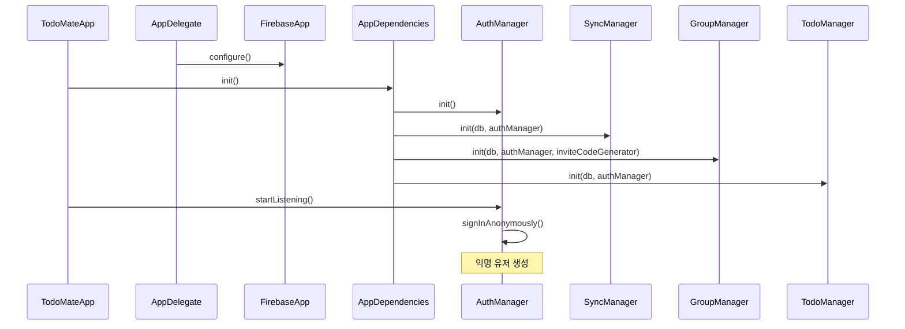
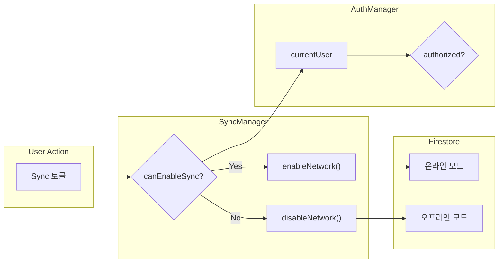

# TodoMate Architecture

앱 개발 시 참고할 아키텍처 문서. 객체 간 의존 관계 및 데이터 흐름을 정리한다.

## 의존성 그래프 (Dependency Graph)



---

## 초기화 순서 (Initialization Flow)



---

## Sync On/Off 동작 원리



---

## 핵심 규칙

| 조건 | Sync 가능 여부 |
|------|----------------|
| 익명 유저 (`authorized: false`) | ❌ Sync OFF 강제 |
| 로그인 + `authorized: false` | ❌ Sync OFF 강제 |
| 로그인 + `authorized: true` | ✅ Sync ON 가능 |

---

## 파일 구조

```
App/
├── TodoMateApp.swift          # @main, DI 주입
├── AppDelegate.swift          # Firebase 초기화
├── AppDependencies.swift      # DI 컨테이너
├── Managers/
│   ├── AuthManager.swift      # 인증 상태 관리
│   ├── SyncManager.swift      # 네트워크 제어
│   ├── GroupManager.swift     # 그룹 및 협업 관리
│   └── TodoManager.swift      # 투두 CRUD 관리
├── Models/
│   ├── User.swift             # 유저 모델
│   ├── Group.swift            # 그룹 모델
│   ├── Todo.swift             # 투두 모델
│   └── TodoStatus.swift       # 투두 상태 Enum
└── Utilities/
    ├── InviteCodeGenerator.swift # 그룹 초대 코드 생성
    └── Log.swift              # 로깅 유틸리티
```
