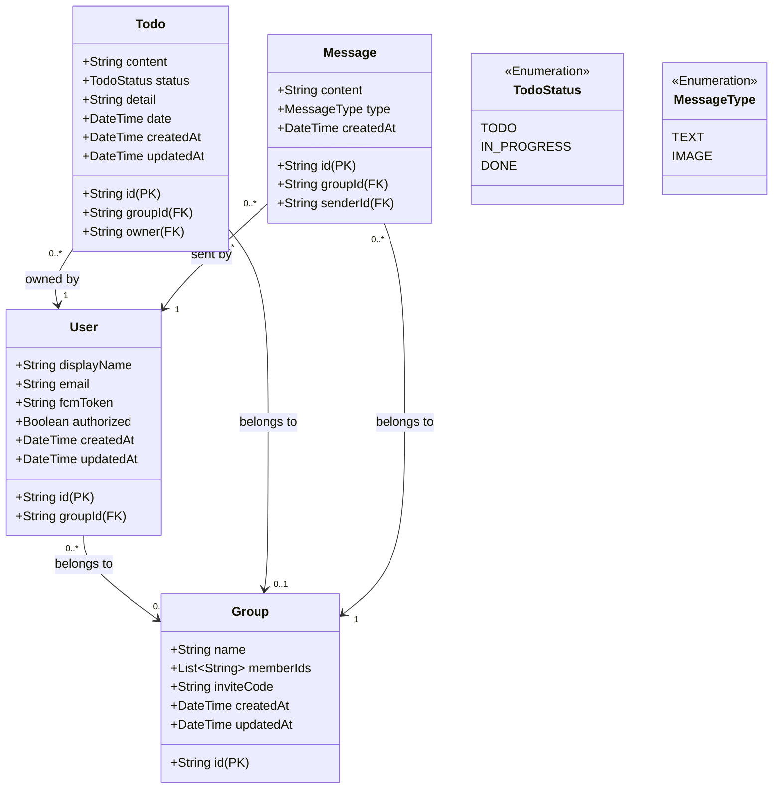

# 데이터 모델 (Data Models)

앱의 주요 데이터 모델을 정의합니다. 특정 프로그래밍 언어(Swift)에 종속되지 않는 범용적인 스키마입니다.

## 엔터티 관계도 (ER Diagram)

## 스키마 정의

### 1. User (유저)
앱의 사용자 정보를 담습니다.

| 필드명 | 타입 | 설명 | 비고 |
|---|---|---|---|
| `id` | String | 유저 고유 ID (Document ID) | PK |
| `displayName` | String | 유저 표시 이름 | 기본값: "Guest" |
| `email` | String | 이메일 주소 | |
| `groupId` | String? | 소속된 그룹의 ID | FK (Nullable) |
| `fcmToken` | String? | Push 알림용 토큰 | Nullable |
| `authorized` | Boolean | 정식 로그인(인증) 여부 | `false`: 익명, `true`: 로그인 |
| `createdAt` | DateTime | 생성 일시 | Server Timestamp |
| `updatedAt` | DateTime | 수정 일시 | Server Timestamp |

### 2. Group (그룹)
유저들이 모여 투두를 공유하는 그룹입니다.

| 필드명 | 타입 | 설명 | 비고 |
|---|---|---|---|
| `id` | String | 그룹 고유 ID (Document ID) | PK |
| `name` | String | 그룹 이름 | |
| `memberIds` | List<String> | 그룹 멤버들의 User ID 목록 | |
| `inviteCode` | String | 그룹 초대를 위한 고유 코드 | |
| `createdAt` | DateTime | 생성 일시 | Server Timestamp |
| `updatedAt` | DateTime | 수정 일시 | Server Timestamp |

### 3. Todo (할 일)
개인 또는 그룹의 할 일 항목입니다.

| 필드명 | 타입 | 설명 | 비고 |
|---|---|---|---|
| `id` | String | 투두 고유 ID (Document ID) | PK |
| `groupId` | String? | 소속된 그룹 ID (공유 투두인 경우) | FK (Nullable) |
| `owner` | String | 투두 생성자/담당자의 User ID | FK |
| `content` | String | 할 일 내용 | |
| `status` | Enum | 진행 상태 | `TODO`, `IN_PROGRESS`, `DONE` |
| `detail` | String | 상세 설명/메모 | |
| `date` | DateTime | 목표 날짜 | |
| `createdAt` | DateTime | 생성 일시 | Server Timestamp |
| `updatedAt` | DateTime | 수정 일시 | Server Timestamp |

### 4. Message (메시지)
실시간 그룹 채팅에서 주고받는 메시지 정보입니다.

| 필드명 | 타입 | 설명 | 비고 |
|---|---|---|---|
| `id` | String | 메시지 고유 ID (Document ID) | PK |
| `groupId` | String | 소속된 그룹 ID | FK |
| `senderId` | String | 메시지를 보낸 유저 ID | FK |
| `content` | String | 메시지 본문 (텍스트 또는 이미지 URL) | |
| `type` | Enum | 메시지 타입 | `TEXT`, `IMAGE` |
| `createdAt` | DateTime | 전송 일시 | Server Timestamp |

### 5. TodoStatus (투두 상태 Enum)
Todo의 진행 상태를 나타냅니다.

- **TODO**: 할 일 (시작 전)
- **IN_PROGRESS**: 진행 중
- **DONE**: 완료

### 6. MessageType (메시지 타입 Enum)
채팅 메시지의 종류를 나타냅니다.

- **TEXT**: 일반 텍스트 메시지
- **IMAGE**: 사진/이미지 메시지 (`content` 필드에 이미지 URL 저장)
