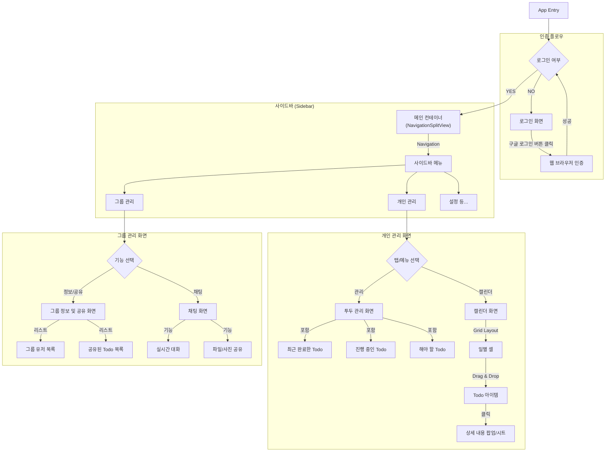

# 화면 계층 구조 (UI Hierarchy)

macOS 앱의 화면 구성 및 네비게이션 구조를 정의합니다.

## 화면 구조 다이어그램

## 주요 화면 설명

### 1. 로그인 (LoginView)
- 앱 최초 실행 시 노출
- 구글 로그인 버튼 제공 (웹 브라우저로 이동하여 인증 진행)

### 2. 메인 컨테이너 (MainContainer)
- **macOS 스타일 사이드바**를 기본 네비게이션으로 사용
- 좌측 사이드바에서 '개인 공간', '그룹 공간' 등을 선택하여 우측 콘텐츠 영역을 전환

### 3. 개인 관리 (Personal Section)
- **투두 관리 (DashboardView)**:
    - 완료/진행중/예정 투두를 섹션별로 구분하여 관리
- **캘린더 (CalendarView)**:
    - 그리드 형태의 월간/주간 달력
    - 각 날짜 셀(Cell) 안에 Todo 표시
    - **Interactions**: Drag & Drop으로 날짜 변경, 클릭 시 상세 보기(Popover/Sheet)

### 4. 그룹 관리 (Group Section)
- **그룹 정보 (GroupInfoView)**:
    - 그룹에 속한 유저 프로필 목록 확인
    - 그룹 내에서 공유된 Todo 리스트 확인 및 관리
- **채팅 (ChatView)**:
    - 실시간 텍스트 메시지 전송
    - 이미지 및 파일 공유 기능
