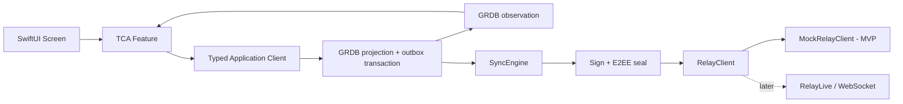
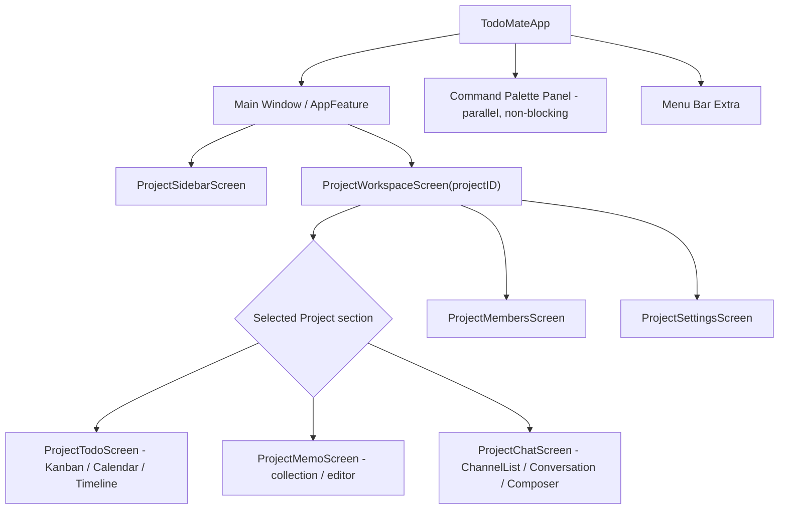

# TodoMate 앱 아키텍처

> 상태: 목표 제품 계약과 migration 경계. 현재 구현은 여전히 legacy Home/Memo/Group
> presentation을 사용한다. 개인 Todo·Memo persistence는 GRDB와 등록형 App Group 전환
> 경계를 사용하지만 Project aggregate·sync·TCA 목표가 구현되었다는 의미는 아니다.
>
> Canonical working source: [TodoMate Future Core Architecture v0.2](https://linear.app/hot6/document/todomate-future-core-architecture-v02-05b1682c21b0)

## 제품 invariant

Product Project가 유일한 최상위 사용자 workspace다.

- 개인 사용은 별도 personal aggregate가 아니라 멤버가 한 명인 Project다.
- Todo, Memo, 다중 Channel Chat은 모두 선택된 Project에 속한다.
- Local, Hosted, Shared, Offline, Detached는 같은 Project의 lifecycle/sync 상태다.
- Local Project는 RelayBinding 없이 동작하며 나중에 같은 Project를 hosting하고 공유할 수 있다.
- route와 command는 안정적인 `ProjectID`, `TodoID`, `MemoID`, `ChannelID`를 사용한다.
  Relay URL은 화면 identity가 아니다.
- Kanban, Calendar와 Timeline은 같은 `TodoID`의 projection이다. 계획 시작·마감 시간과 실제
  시작·완료·재개 이력은 별도 의미와 필드로 유지한다.

legacy Home/Memo/Group 분리는 migration input이며 목표 제품 모델이 아니다.

## 현재 구현과 목표의 경계

| 경계 | 현재 전환 상태 | 목표 owner |
| --- | --- | --- |
| Presentation | `@Observable` Store와 legacy 최상위 destination | `TodoMatePresentation` TCA Feature |
| Canonical data | 개인 Todo·Memo GRDB/App Group 전환, Project schema 미구현 | GRDB Project/Membership/Todo/Memo/Chat projection |
| Sharing | legacy group interface 또는 stub | adapter-neutral `RelayClient`를 통과하는 `SyncEngine` |
| MVP transport | production-shaped 공유 runtime 미구현 | 결정론적 `MockRelayClient` |
| Live transport | 과거 Nostr/Relay 연구 | MVP gate 밖의 후속 `RelayLive` adapter |

목표 package 생성, schema migration과 TCA 화면 구현은 각각의 Linear 구현 이슈가 소유한다.
제품 계약 문서는 그 파일을 조용히 이동하거나 구현·검증 완료를 주장하지 않는다.

각 target의 call site, import 방향, 현재 producer/consumer owner map과 이슈별 이동 순서는
[SPM 경계와 점진적 migration 계획](spm-migration-plan.md)을 따른다. 이 계획은 목표 구조의
상세 handoff이며 package가 이미 생성되었다는 의미가 아니다.

## Clean Architecture와 의존성 주입

의존성은 Presentation → Application → Domain/SyncContracts 방향으로 안쪽을 향한다.
GRDB, SyncEngine, E2EE와 Apple KeyStore는 안쪽 계층의 port를 구현하는 concrete adapter이며,
서로 직접 결합하지 않고 `TodoMate.app` composition root에서 조립한다.

앱 root는 CartLog식 immutable `AppDependencies` value를 만들 수 있지만 이를 전역 service
locator나 `@Observable` 상태 저장소로 사용하지 않는다. AppFeature는 root dependency를
feature별 typed Application client로 나누어 TCA에 주입하고, render-only View는 value,
binding과 callback만 받는다. Preview/TestStore/UI scenario별 mock 조립, Release linkage 금지와
legacy `CoreDIContainer`/`PublicDIContainer`/`AppDIContainer` 제거 순서는
[SPM 계획의 Clean Architecture와 dependency composition](spm-migration-plan.md#clean-architecture와-dependency-composition)을
따른다.

## 목표 runtime과 ownership

## 현재 local persistence migration

현재 migration slice는 legacy 개인 Todo·Memo·휴지통을 App Group의 단일 GRDB 파일에
저장한다. 이는 목표 Project aggregate와 schema가 이미 구현되었다는 의미가 아니다. 현재
Widget extension은 반복되는 macOS App Data 접근 prompt를 차단하기 위해 제품과 Xcode
target에서 임시 제거했다. 앱만 read-write migration과 legacy import를 수행한다.

- Bundle ID는 Release `io.hotcs6.TodoMate`, Debug `io.hotcs6.TodoMateDebug`를 유지한다.
  App Group은 향후 iOS target과 같은 등록형 namespace를 사용할 수 있도록 각각
  `group.io.hotcs6.TodoMate`, `group.io.hotcs6.TodoMateDebug`를 canonical identifier로 쓴다.
  Debug 앱은 `REGISTER_APP_GROUPS = YES`를 명시해 signed Xcode build의 provisioning
  profile이 registered Debug App Group entitlement를 검증하게 한다.
- Release 전환 build는 기존 Team-ID App Group도 entitlement에 함께 둔다. 앱은 legacy GRDB를
  WAL-consistent backup으로 새 group의 staging DB에 복제하고 schema·integrity·projection과
  marker를 확인한 뒤 같은 filesystem에서 원자적으로 승격한다. legacy DB는 삭제하지 않는다.
  Debug 앱은 legacy Team-ID group을 entitlement와 container lookup에서 제외하고 registered
  Debug group만 사용하므로 별도 container migration을 실행하지 않는다.
- marker는 전환 시점의 legacy Todo·Memo projection signature를 보존한다. 이후 legacy DB가
  달라지면 앱은 자동 덮어쓰기나 재병합을 하지 않고 fail-closed한다.
- Widget 재도입 시에는 `TodoMateWidgetReadModel`의 narrow read-only API, canonical App Group
  provisioning, 실제 WidgetKit host 검증을 별도 이슈에서 다시 연결한다. 현재 Data package의
  read-only reader는 그 후속 구현을 위한 기반일 뿐 제품에 포함된 Widget 증거가 아니다.
- 테이블과 컬럼은 영문 단수형 lower camel case를 사용한다.
- Swift record의 `ownerID`는 DB의 `ownerId`에 명시적으로 매핑한다.

현재 ProjectID가 없는 Todo·Memo와 legacy User/Group/Message를 목표 Project aggregate로
옮기는 before/after 규칙은 [Project-first legacy entity migration map](project-migration-map.md)에
정리한다. 이 문서는 mapping 계약이며 실제 Project schema와 실행 migration은 후속 이슈가
소유한다.
- 공통 변경 메타데이터는 `createdAt`, `updatedAt`, `deletedAt`, `localRevision`이다.
- `deletedAt`은 soft-delete tombstone이며 `localRevision`은 로컬 행 변경 순서다. 둘 다
  Nostr 이벤트 ID나 릴레이 버전을 의미하지 않는다.
- 같은 프로세스의 commit은 GRDB `DatabaseRegionObservation`으로 감지한다. 다른
  프로세스에는 Darwin notification을 전달하고, 수신 측 repository가 최신 값을 다시
  조회한다. Widget extension이 제거된 현재 앱은 `WidgetCenter` 갱신을 요청하지 않는다.
- DB 변경 notification은 UI 무효화 신호일 뿐 내구성 있는 동기화 로그가 아니다. 목표
  Sync의 `ProjectOperation` outbox는 local mutation과 같은 transaction에 기록할 예정이며,
  현재 notification은 그 구현 증거가 아니다.

## 목표 runtime persistence와 sync

- GRDB는 Project, Membership, Todo, Memo, Chat과 durable operation outbox의 client canonical
  source다.
- local mutation과 `ProjectOperation` outbox entry는 하나의 transaction에서 commit한다.
- UI는 network ACK를 canonical state로 취급하지 않고 GRDB observation으로 갱신한다.
- inbound는 outer envelope format·signature·key-epoch preflight → E2EE open → decrypted
  operation의 membership/content-author authorization → deterministic reconcile → GRDB commit
  → observation 순서를 따른다. 암호문 내부 author 정보가 필요한 검증을 decrypt 전에
  수행하거나 plaintext metadata로 노출하지 않는다.
- `MockRelayClient`는 future Live adapter와 같은 request, response, event, error,
  connection-state 계약을 사용하며 remote 결과를 GRDB에 직접 삽입하지 않는다.
- Todo와 Memo는 각각의 typed Project topic을, Chat은 Channel별 typed topic을 사용한다.
  Project metadata와 Membership도 별도 topic으로 구독하며 모두 같은 SyncEngine/outbox/
  reconcile 경로를 통과한다.

## 목표 화면 계층

`ProjectWorkspaceFeature`가 selected-section state와 child lifetime을 소유한다. 최종 section
control을 Sidebar child로만 둘지 Workspace picker도 병행할지는 non-blocking product review
checkpoint이며 Feature ownership을 바꾸지 않는다.

Screen은 TCA Store, observation lifetime, effect, selection, navigation과 presentation을
소유한다. render-only View는 value, binding과 좁은 callback만 받는다. TCA State에는 두 번째
canonical entity store가 아니라 observation projection과 transient UI state만 둔다.

## Membership과 보안 계약

- V1 역할은 Owner 1명과 Member다. Membership role과 content-author 권한은 별개다.
- Todo, Memo, Message는 작성자만 수정·삭제할 수 있다.
- Owner는 membership과 Project 설정을 관리하지만 다른 작성자의 Todo, Memo, Message를
  편집·삭제할 수 없다.
- ownership transfer는 대상 Member가 수락해야 완료된다. 현재 Owner는 수락 전 탈퇴할 수 없다.
- signed voluntary leave와 Owner kick은 이후 write/subscription/outbox 전송을 차단하고 남은
  멤버의 Project key epoch를 회전한다.
- 제거된 client는 마지막 동기화 snapshot을 Detached read-only로 유지한다.
- Detached 사용자는 본인 Todo/Memo만 새 ID로 새로운 1인 Local Project에 복사할 수
  있다. Chat은 복사하지 않는다.
- identity private key는 Keychain에만 둔다. encrypted recovery file과 QR은 같은 identity
  payload의 표현이며 plaintext Project key나 KeyEnvelope를 포함하지 않는다.
- Project content key는 identity key와 분리하고 각 Member의 public key용 KeyEnvelope를 만든다.
  kick/leave 시 남은 멤버에게 새 key epoch의 envelope를 배포한다.

## Non-blocking review checkpoint

다음 항목은 되돌리기 어려운 정책·화면을 고정하기 전 사용자 리뷰가 필요하지만 type,
fixture, reducer shell과 reversible foundation을 막지 않는다.

- Todo/Memo/Chat section을 Sidebar child로만 둘지 Workspace picker를 병행할지
- Smart View와 mini Calendar를 current Project로 제한할지 모든 Project를 집계할지
- 좁은 창의 Inspector를 overlay로 할지 content reflow로 할지
- semantic UI의 최종 색, typography와 density
- shared Project archive/delete를 남은 멤버에게 어떻게 표현할지
- ChatChannel metadata를 creator만 관리할지 Owner에게 구조 관리 capability도 줄지
- Memo whole-document conflict copy를 사용자에게 어떻게 노출할지
- Todo same-field 동률을 event ID로 할지 author/device + event ID로 할지
- kick/leave와 미승인 outbox cutoff를 어떤 상태·문구로 설명할지

## MVP와 후속 경계

Full Mock client MVP는 Relay-free Project 생성·선택·재실행과 local Todo/Memo/Chat, Todo
projection, multi-client encrypted sync, membership/E2EE/outbox/recovery, Detached read-only,
TCA TestStore transition, AccessibilityID, fixed UI scenario, POM journey와 deterministic
screenshot catalog를 포함한다.

완료는 관련 canonical `just` 명령의 certificate/provisioning-free lane이 merge된 exact SHA에서
통과하고 그 SHA·명령·결과가 Linear에 남았을 때만 판정한다. 세부 증거 형식은
[TodoMate MVP Execution & Evidence Policy](https://linear.app/hot6/document/todomate-mvp-execution-and-evidence-policy-6e70dadd7d09)를 따른다.

Live Relay server/adapter/migration/운영, Attachment, Developer ID·notarized 배포, iOS,
custom status/Epic/sub-issue와 AI participant는 포함하지 않는다.

## Host integration

`TodoMate.app`은 Scene, Window, Panel, AppKit, AppIntent와 dependency composition을 소유한다.
기존 `WindowManager`와 overlay는 현재 host integration이며, 관련 TCA/App shell 이슈가 교체할
때까지 lifecycle을 보존해야 한다.
