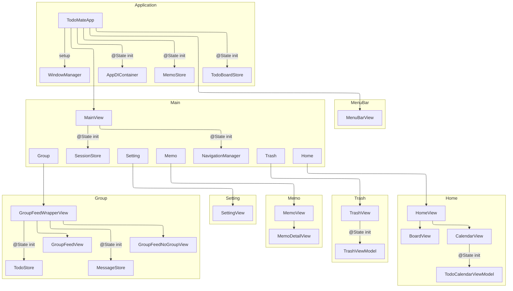
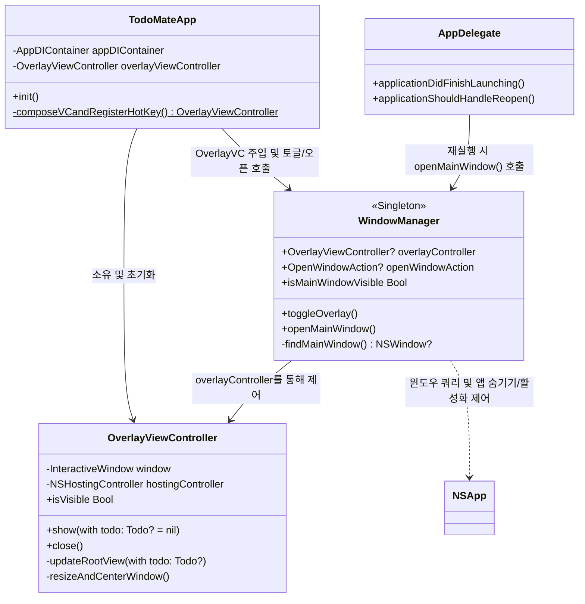

## Presentation Layer

## Local Persistence

개인 Todo·Memo·휴지통 데이터의 진실의 원천은 App Group의 단일 GRDB 파일이다. 앱과
위젯은 각각 별도 `DatabasePool`을 열지만 동일한 파일 URL과 migration 집합을 사용한다.
앱만 read-write 연결로 migration과 legacy import를 수행한다. 위젯은 migration이 완료된
스키마만 `Configuration.readonly = true`로 열고 `GRDBTodoReader` 조회 API만 사용한다.

- 테이블과 컬럼은 영문 단수형 lower camel case를 사용한다.
- Swift record의 `ownerID`는 DB의 `ownerId`에 명시적으로 매핑한다.
- 공통 변경 메타데이터는 `createdAt`, `updatedAt`, `deletedAt`, `localRevision`이다.
- `deletedAt`은 soft-delete tombstone이며 `localRevision`은 로컬 행 변경 순서다. 둘 다
  Nostr 이벤트 ID나 릴레이 버전을 의미하지 않는다.
- 같은 프로세스의 commit은 GRDB `DatabaseRegionObservation`으로 감지한다. 다른
  프로세스에는 Darwin notification을 전달하고, 수신 측 repository가 최신 값을 다시
  조회한다. WidgetKit timeline은 장기 observation 대신 앱이 `WidgetCenter` 갱신을 요청한
  뒤 read-only query로 새 snapshot을 만든다.
- DB 변경 notification은 UI 무효화 신호일 뿐 내구성 있는 동기화 로그가 아니다. 향후
  Nostr 발행은 로컬 변경과 같은 transaction에 기록하는 별도 outbox를 사용한다.

## WindowManager

