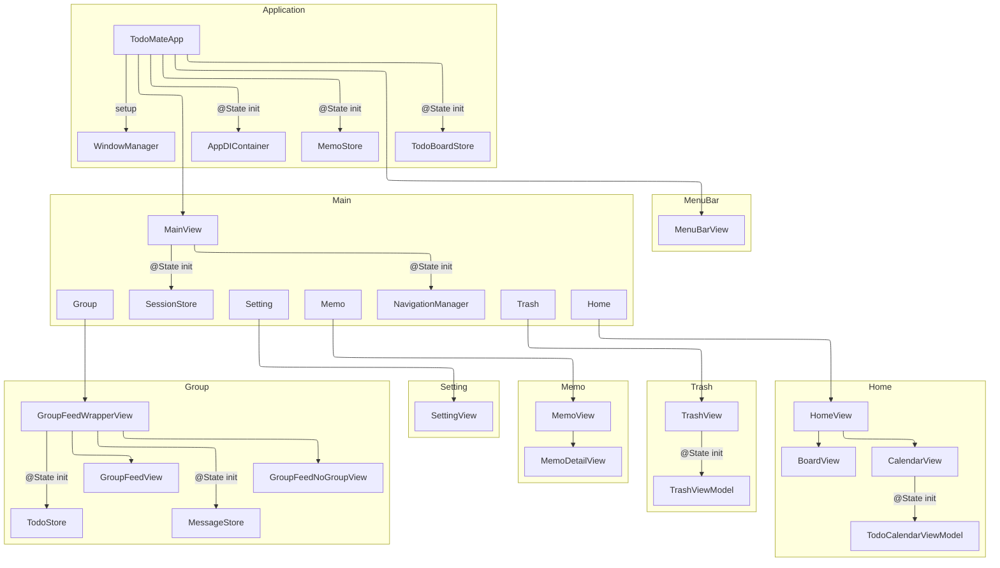
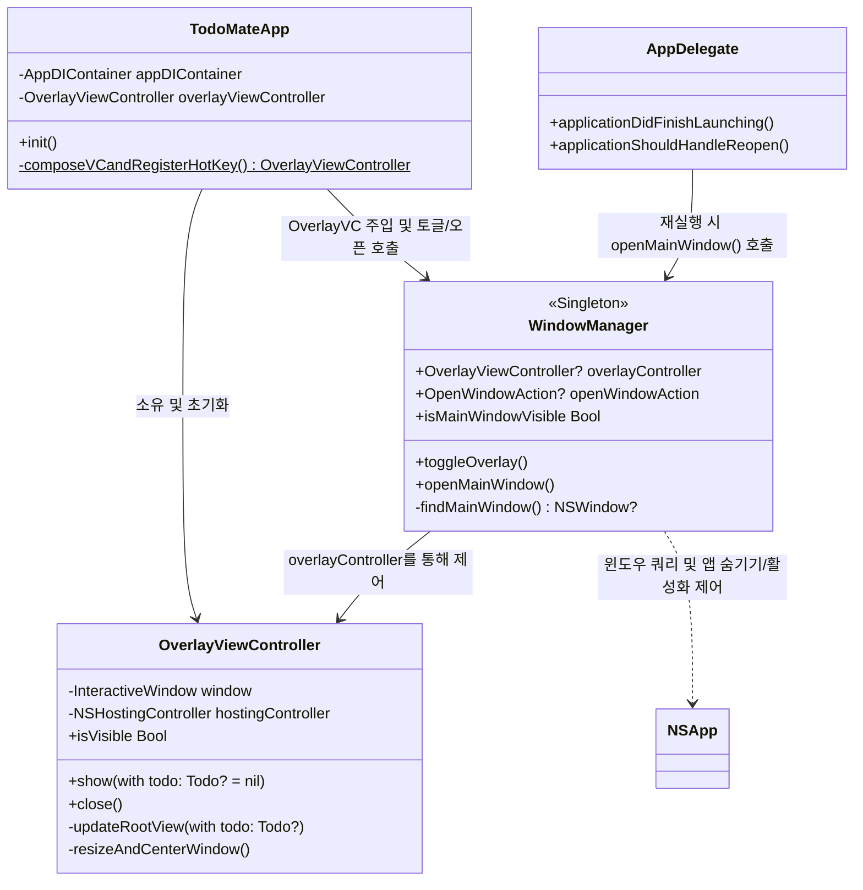

## Presentation Layer

```mermaid
---
config:
  layout: elk
---
graph TD
    subgraph UserFlow[Application]
        App[TodoMateApp]:::app
        DI[AppDIContainer]:::app
        PersonalTodoStore[TodoBoardStore]:::store
        PersonalMemoStore[MemoStore]:::store
        WinMgr[WindowManager]:::app
    end

    subgraph MenuBarNav[MenuBar]
        MenuBar[MenuBarView]:::view
    end

    subgraph StateManagement[Main]
        MainView[MainView]:::view
        NaviManager[NavigationManager]:::vm
        Session[SessionStore]:::store

        DestSettings["Setting"]:::view
        DestHome["Home"]:::view
        DestMemo["Memo"]:::view
        DestGroup["Group"]:::view
        DestTrash["Trash"]:::view
    end

    subgraph FeatureHome["Home"]
        HomeView[HomeView]:::view
        BoardView[BoardView]:::view
        CalendarView[CalendarView]:::view
        CalVM[TodoCalendarViewModel]:::vm
    end

    subgraph FeatureTrash["Trash"]
        TrashView[TrashView]:::view
        TrashVM[TrashViewModel]:::vm
    end

    subgraph FeatureMemo[Memo]
        MemoView[MemoView]:::view
        MemoDetail[MemoDetailView]:::view
    end

    subgraph FeatureSetting[Setting]
        SettingView[SettingView]:::view
    end

    subgraph FeatureGroup[Group]
        GroupWrapper[GroupFeedWrapperView]:::view
        GroupTodoStore[TodoStore]:::store
        MessageStore[MessageStore]:::store
        GroupFeed[GroupFeedView]:::view
        GroupFeedNoGroup[GroupFeedNoGroupView]:::view
    end

    App -- "@State init" --> DI
    App --> MainView
    App --> MenuBar
    App -- "@State init" --> PersonalTodoStore
    App -- "@State init" --> PersonalMemoStore
    App -- "setup" --> WinMgr


    MainView -- "@State init" --> Session
    MainView -- "@State init" --> NaviManager


    DestGroup --> GroupWrapper
    GroupWrapper -- "@State init" --> GroupTodoStore
    GroupWrapper -- "@State init" --> MessageStore
    GroupWrapper --> GroupFeed
    GroupWrapper --> GroupFeedNoGroup

    DestHome --> HomeView
    DestMemo --> MemoView
    DestSettings --> SettingView
    DestTrash --> TrashView
    TrashView -- "@State init" --> TrashVM

    HomeView --> BoardView
    HomeView --> CalendarView
    CalendarView -- "@State init" --> CalVM

    MemoView  --> MemoDetail
```

## WindowManager

```mermaid
classDiagram
    class TodoMateApp {
        -AppDIContainer appDIContainer
        -OverlayViewController overlayViewController
        +init()
        -composeVCandRegisterHotKey()$ OverlayViewController
    }

    class AppDelegate {
        +applicationDidFinishLaunching()
        +applicationShouldHandleReopen()
    }

    class WindowManager {
        <<Singleton>>
        +OverlayViewController? overlayController
        +OpenWindowAction? openWindowAction
        +isMainWindowVisible Bool
        +toggleOverlay()
        +openMainWindow()
        -findMainWindow() NSWindow?
    }

    class OverlayViewController {
        -InteractiveWindow window
        -NSHostingController hostingController
        +isVisible Bool
        +show(with todo: Todo? = nil)
        +close()
        -updateRootView(with todo: Todo?)
        -resizeAndCenterWindow()
    }

    TodoMateApp --> WindowManager : OverlayVC 주입 및 토글/오픈 호출
    TodoMateApp --> OverlayViewController : 소유 및 초기화
    AppDelegate --> WindowManager : 재실행 시 openMainWindow() 호출
    WindowManager --> OverlayViewController : overlayController를 통해 제어
    WindowManager ..> NSApp : 윈도우 쿼리 및 앱 숨기기/활성화 제어
```
