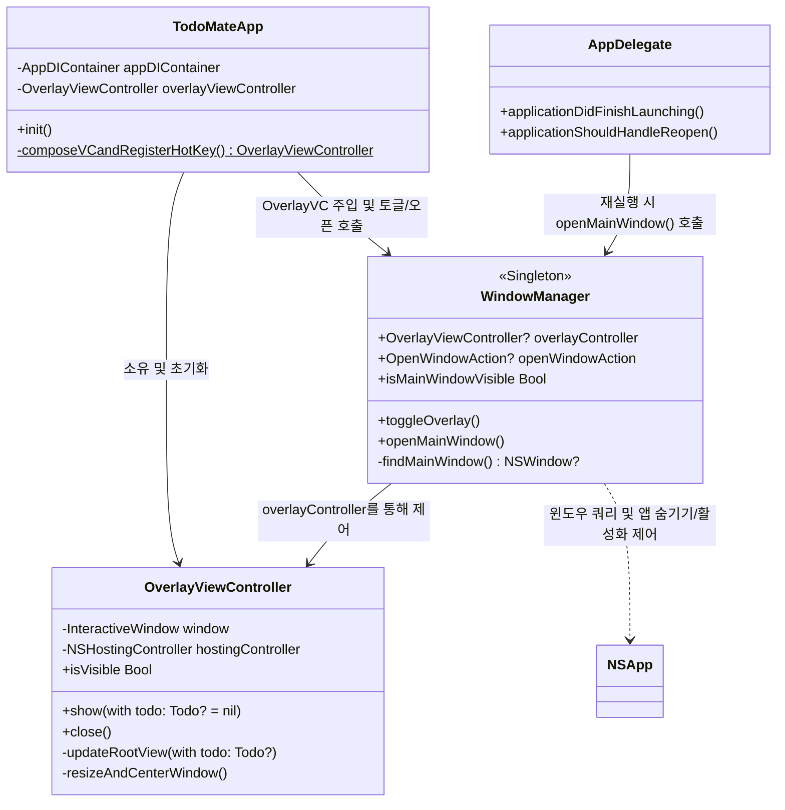

## AppFlow

```mermaid
graph TD
    classDef app fill:#f9f9f9,stroke:#333,stroke-width:2px;
    classDef store fill:#e1f5fe,stroke:#0277bd,stroke-width:2px;
    classDef vm fill:#fff3e0,stroke:#ef6c00,stroke-width:2px;
    classDef view fill:#e8f5e9,stroke:#2e7d32,stroke-width:2px;

    subgraph UserFlow[Application Entry]
        App[TodoMateApp]:::app
        DI[AppDIContainer]:::app
        PersonalTodoStore[TodoBoardStore]:::store
        PersonalMemoStore[MemoStore]:::store
    end

    subgraph StateManagement[Main & Navigation State]
        MainView[MainView]:::view
        NavMgr[NavigationManager]:::vm
        Session[SessionStore]:::store
    end

    subgraph SidebarNav[Sidebar Navigation]
        Sidebar[Sidebar]:::view
        DestSettings["Settings (SettingView)"]:::view
        DestTodo["Todo (Board/Calendar)"]:::view
        DestMemo["Memo (MemoView)"]:::view
        DestGroup["Group (GroupFeedWrapperView)"]:::view
    end

    subgraph FeatureHome["Home(Todo) Views"]
        BoardView[BoardView]:::view
        CalendarView[CalendarView]:::view
        CalVM[TodoCalendarViewModel]:::vm
    end

    subgraph FeatureMemo[Memo Feature]
        MemoView[MemoView]:::view
        MemoDetail[MemoDetailView]:::view
    end

    subgraph FeatureGroup[Group Feature]
        GroupWrapper[GroupFeedWrapperView]:::view
        GroupTodoStore[TodoStore]:::store
        MessageStore[MessageStore]:::store
        GroupFeed[GroupFeedView]:::view
        GroupFeedNoGroup[GroupFeedNoGroupView]:::view
    end

    App -- "@State init" --> PersonalTodoStore
    App -- "@State init" --> PersonalMemoStore
    App -- environment --> MainView

    MainView -- "@State init" --> NavMgr
    MainView -- "@State init" --> Session
    MainView --> Sidebar

    Sidebar -- selection --> NavMgr

    MainView -- "switch navMgr.selection" --> DestSettings
    MainView -- "switch navMgr.selection" --> DestTodo
    MainView -- "switch navMgr.selection" --> DestMemo
    MainView -- "switch navMgr.selection" --> DestGroup

    DestGroup --> GroupWrapper
    GroupWrapper -- "@State init" --> GroupTodoStore
    GroupWrapper -- "@State init" --> MessageStore
    GroupWrapper --> GroupFeed
    GroupWrapper --> GroupFeedNoGroup

    DestTodo -- "switch navMgr.viewMode" --> BoardView
    DestTodo -- "switch navMgr.viewMode" --> CalendarView

    CalendarView -- "@State init" --> CalVM

    PersonalTodoStore -. "@Environment" .-> BoardView
    PersonalTodoStore -. "@Environment" .-> CalendarView
    PersonalMemoStore -. "@Environment" .-> MemoView

    MemoView -- "@State" --> MemoDetail
```

## WindowManager

```mermaid
classDiagram
    class TodoMateApp {
        -AppDIContainer appDIContainer
        -OverlayViewController overlayViewController
        +init()
        -composeVCandRegisterHotKey()$ OverlayViewController
    }

    class AppDelegate {
        +applicationDidFinishLaunching()
        +applicationShouldHandleReopen()
    }

    class WindowManager {
        <<Singleton>>
        +OverlayViewController? overlayController
        +OpenWindowAction? openWindowAction
        +isMainWindowVisible Bool
        +toggleOverlay()
        +openMainWindow()
        -findMainWindow() NSWindow?
    }

    class OverlayViewController {
        -InteractiveWindow window
        -NSHostingController hostingController
        +isVisible Bool
        +show(with todo: Todo? = nil)
        +close()
        -updateRootView(with todo: Todo?)
        -resizeAndCenterWindow()
    }

    TodoMateApp --> WindowManager : OverlayVC 주입 및 토글/오픈 호출
    TodoMateApp --> OverlayViewController : 소유 및 초기화
    AppDelegate --> WindowManager : 재실행 시 openMainWindow() 호출
    WindowManager --> OverlayViewController : overlayController를 통해 제어
    WindowManager ..> NSApp : 윈도우 쿼리 및 앱 숨기기/활성화 제어
```
