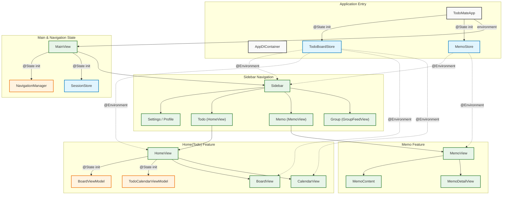

```mermaid
graph TD
    classDef app fill:#f9f9f9,stroke:#333,stroke-width:2px;
    classDef store fill:#e1f5fe,stroke:#0277bd,stroke-width:2px;
    classDef vm fill:#fff3e0,stroke:#ef6c00,stroke-width:2px;
    classDef view fill:#e8f5e9,stroke:#2e7d32,stroke-width:2px;

    subgraph UserFlow[Application Entry]
        App[TodoMateApp]:::app
        DI[AppDIContainer]:::app
        GlobalTodoStore[TodoBoardStore]:::store
        GlobalMemoStore[MemoStore]:::store
    end

    subgraph StateManagement[Main & Navigation State]
        MainView[MainView]:::view
        NavMgr[NavigationManager]:::vm
        Session[SessionStore]:::store
    end

    subgraph SidebarNav[Sidebar Navigation]
        Sidebar[Sidebar]:::view
        DestSettings["Settings / Profile"]:::view
        DestTodo["Todo (HomeView)"]:::view
        DestMemo["Memo (MemoView)"]:::view
        DestGroup["Group (GroupFeedView)"]:::view
    end

    subgraph FeatureHome["Home(Todo) Feature"]
        HomeView[HomeView]:::view
        BoardVM[BoardViewModel]:::vm
        CalVM[TodoCalendarViewModel]:::vm

        BoardView[BoardView]:::view
        CalendarView[CalendarView]:::view
    end

    subgraph FeatureMemo[Memo Feature]
        MemoView[MemoView]:::view
        MemoContent[MemoContent]:::view
        MemoDetail[MemoDetailView]:::view
    end
    App -- "@State init" --> GlobalTodoStore
    App -- "@State init" --> GlobalMemoStore
    App -- environment --> MainView
    MainView -- "@State init" --> NavMgr
    MainView -- "@State init" --> Session
    MainView --> Sidebar
    Sidebar --> DestSettings
    Sidebar --> DestTodo
    Sidebar --> DestMemo
    Sidebar --> DestGroup
    GlobalTodoStore -. "@Environment" .-> Sidebar
    GlobalMemoStore -. "@Environment" .-> Sidebar

    GlobalTodoStore -. "@Environment" .-> HomeView
    GlobalTodoStore -. "@Environment" .-> BoardView
    GlobalTodoStore -. "@Environment" .-> CalendarView

    GlobalMemoStore -. "@Environment" .-> MemoView
    DestTodo --> HomeView
    HomeView -- "@State init" --> BoardVM
    HomeView -- "@State init" --> CalVM
    HomeView --> BoardView
    HomeView --> CalendarView
    DestMemo --> MemoView
    MemoView --> MemoContent
    MemoView --> MemoDetail
```
