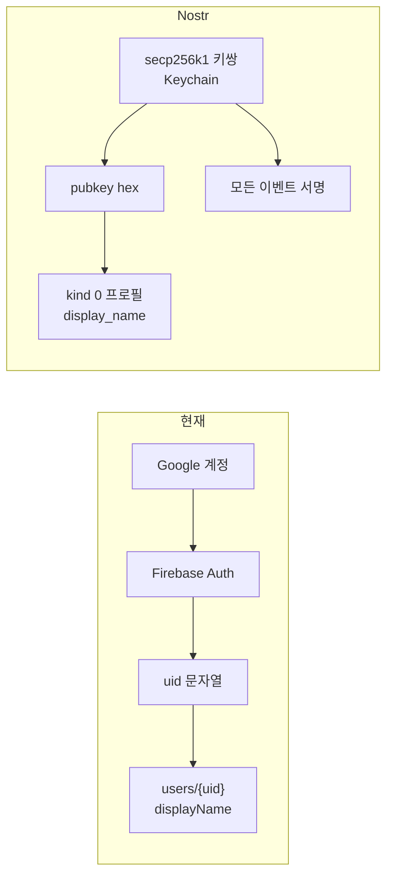
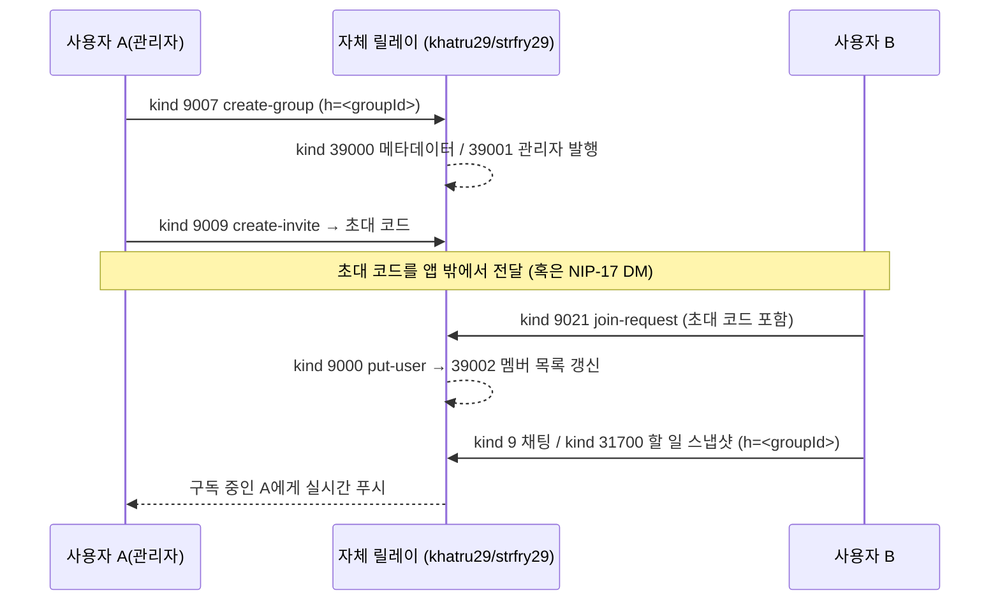
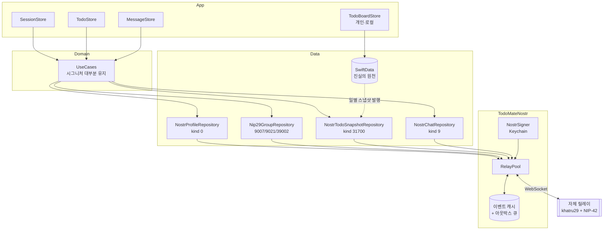
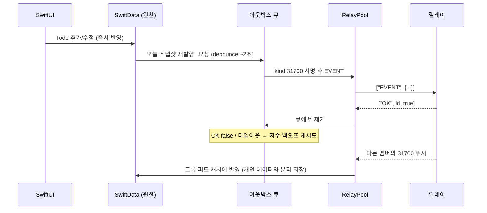

# 02. TodoMate × Nostr 설계

> [!WARNING]
> 폐기된 Live Relay 설계 연구다. 현재 제품 architecture나 MVP 계획이 아니며 기준은
> [`README.md`](README.md)와 [`../app-architecture.md`](../app-architecture.md)다.

> [01-nostr-primer.md](01-nostr-primer.md)를 먼저 읽은 것을 전제로 한다.

---

## 1. 설계 원칙

1. **로컬 우선(Local-first).** SwiftData가 진실의 원천이다. Nostr는 전송·동기화 계층일 뿐이며, 릴레이가 전부 죽어도 개인 기능은 100% 동작해야 한다. (현재의 온/오프라인 모드 분리 철학과 동일)
2. **Domain 레이어는 최대한 건드리지 않는다.** 교체 대상은 `TodoMateData`의 구현체다. UseCase 시그니처가 바뀌면 View까지 파급되므로, 프로토콜 변경은 불가피한 것만 (§8의 미스매치 목록).
3. **암호화는 나중에 켤 수 있게 설계한다.** 쿼리에 필요한 값은 태그(평문), 내용은 `content`. 그러면 Phase 6에서 `content`만 NIP-44로 감싸면 된다.
4. **NIP-29 호환 가능한 형태로 이벤트를 만든다.** 모든 그룹 이벤트에 `h` 태그를 붙여두면, 나중에 릴레이 정책을 NIP-29로 바꿔도 이벤트 스키마를 다시 짜지 않아도 된다.
5. **되돌릴 수 있게 간다.** Firebase 코드는 마지막 Phase까지 삭제하지 않는다.

---

## 2. 현재 Firebase가 하고 있는 일

| Firestore 컬렉션 | 도메인 | 쓰기 주체 | 읽기 패턴 | 실시간 |
|---|---|---|---|---|
| `v2-users` | `User{id, displayName, groupId}` | 본인 | `read(userId)`, `readAll(groupId:)` | ✗ (수동 refresh) |
| `v2-groups` | `UserGroup{id, name, memberIds[]}` | 멤버(트랜잭션) | `read(groupId)` | ✗ |
| `v2-todos` | `Todo` | 본인 | `owner in [memberIds]` + `date` 범위 | ✗ (`observeTodos`는 빈 스트림) |
| `v2-group_messages` | `GroupMessage` | 본인 | `groupId` + `createdAt` 정렬 | ✓ `addSnapshotListener` |
| `v2-memos` | `Memo` | 본인 | — | — (**`PublicDIContainer`에 미등록. 현재 원격 메모는 미사용**) |

그 외 Firebase 사용처:
- **Auth**: Google Sign-In → uid. `AuthService.listenToAuthStateChanges()`가 `SessionStore`를 구동한다.
- **연결 제어**: `ConnectivityRepository` → `Firestore.disableNetwork()` (오프라인 모드 토글)
- **레거시 임포트**: `LegacyImportRepositoryImpl` — 구 사용자 데이터 이전용. **Nostr 전환과 무관하며 그대로 남긴다.**

핵심 관찰 3가지:

- 그룹 피드는 **읽기 전용**이다. `TodoStore`의 `add/update/delete`는 View에서 호출되지 않고, 개인 Todo가 `SyncTodayTodosUseCase`를 통해 원격으로 올라간 것을 멤버들이 읽기만 한다. → **Nostr에서는 "내 오늘 할 일 스냅샷을 발행"하는 단방향 모델로 단순화할 수 있다.**
- 채팅은 **추가만** 쓰인다. `MessageStore.update/delete`는 존재하지만 View에서 호출되지 않는다. → Nostr의 "이벤트 불변" 제약이 실질적 문제가 되지 않는다.
- 그룹은 **1인 1그룹**이고 `User.groupId` 하나로 표현된다.

---

## 3. 정체성 전환: uid → pubkey



| 항목 | 현재 | 전환 후 |
|---|---|---|
| `User.id` | Firebase uid | pubkey (hex 64자), 표시용은 `npub1...` (NIP-19) |
| `User.displayName` | `v2-users` 문서 필드 | **kind 0** 메타데이터 이벤트 (`display_name`) |
| `User.groupId` | `v2-users` 문서 필드 | 로컬 상태 + 그룹 멤버십 이벤트 (§5) |
| 로그인 | Google OAuth | 키 생성 / `nsec` 가져오기 |
| 로그아웃 | `Auth.signOut()` | 키 잠금 (Keychain에서 언로드) |
| 계정 복구 | Google이 해줌 | **불가능. 키를 잃으면 계정이 사라진다** ← 최대 리스크 |

**키 보관 설계**

| 항목 | 방침 |
|---|---|
| 저장 위치 | macOS Keychain (`kSecClassGenericPassword`) |
| 접근성 | 1차: `kSecAttrAccessibleWhenUnlockedThisDeviceOnly`(기기 한정, 안전) / 기기 간 이동이 필요하면 iCloud Keychain 동기화(`kSecAttrSynchronizable`) — **Q3 결정 필요** |
| 백업 | **NIP-49 `ncryptsec`** (암호로 감싼 개인키) 텍스트 내보내기. 온보딩에서 강제로 1회 유도 |
| 니모닉 | NIP-06(BIP-39 12단어)은 선택. 사용자가 이해하기 쉽지만 구현 추가 |
| 원격 서명 | NIP-46(bunker) 지원은 **범위 밖**. 나중에 `Signer` 프로토콜 구현체를 추가하는 방식으로 확장 가능하게만 설계 |

> `AuthService` 프로토콜의 시그니처는 그대로 살릴 수 있다.
> `signedInUserId` → pubkey, `signIn()` → 키 언락/생성, `listenToAuthStateChanges()` → 키 상태 스트림.
> **`SessionStore`와 그 아래 모든 Store의 이벤트 구동 구조는 손대지 않아도 된다.** 이게 이번 전환에서 가장 다행인 부분이다.

---

## 4. 그룹 모델: 3가지 선택지

### A안 — NIP-29 릴레이 관리형 그룹 ★권장

릴레이가 그룹의 권한 관리자다. 클라이언트는 `h` 태그를 붙여 이벤트를 보내고, 릴레이가 멤버가 아니면 거부한다.



| 항목 | 값 |
|---|---|
| 그룹 생성 | kind **9007** `create-group` |
| 그룹 삭제 | kind **9008** `delete-group` |
| 초대 코드 생성 | kind **9009** `create-invite` |
| 멤버 추가/제거 | kind **9000** `put-user` / **9001** `remove-user` |
| 메타데이터 수정 | kind **9002** `edit-metadata` |
| 가입/탈퇴 요청 | kind **9021** / **9022** |
| 릴레이가 발행하는 상태 | **39000**(메타데이터) **39001**(관리자) **39002**(멤버) **39003**(역할) |
| 접근 플래그 | `private`(멤버만 읽기) / `closed`(가입요청 무시, 초대만) |

**장점**
- 현재 도메인 모델과 거의 1:1로 맞는다: `createGroup`→9007, `joinGroup`→9021, `leaveGroup`→9022, `UserGroup.name`→39000, `UserGroup.memberIds`→39002.
- **Firestore 트랜잭션으로 하던 원자적 멤버십 갱신을 릴레이가 대신 보장한다.** 이게 가장 큰 이득이다.
- 강제 탈퇴(9001), 초대 코드, 스팸 차단이 프로토콜에 이미 있다. 지금 `JoinGroupCard`의 "Group ID 입력 → 가입" UX가 그대로 살아난다.

**단점**
- 그룹이 특정 릴레이에 귀속된다. 릴레이가 죽으면 그룹이 죽는다(로컬 데이터는 살아있음).
- **릴레이 운영자가 내용을 본다.** 단, 릴레이는 우리가 운영하므로 신뢰 모델은 지금(Google이 Firestore를 봄)보다 나빠지지 않는다.
- NIP-29 릴레이 구현체가 커스텀 kind(31700)를 `h` 태그와 함께 받아주는지 **Phase 0에서 반드시 검증**해야 한다. 안 되면 khatru로 직접 정책을 짠다.

### B안 — 앱 자체 관리 그룹 + NIP-44 공유키

그룹 전용 키쌍을 만들고 그 개인키를 멤버에게 NIP-17 DM으로 배포. 키를 가진 사람 = 멤버. 모든 그룹 이벤트의 `content`는 그룹 키로 암호화.

**장점**: 릴레이를 안 가린다. 진짜 E2EE. 릴레이 운영자도 내용을 못 본다.
**단점**: 멤버십·초대·강제 탈퇴·키 로테이션을 전부 직접 구현해야 한다. forward secrecy가 없어 키가 유출되면 과거 전체가 노출된다. 강제 탈퇴 = 키 로테이션 + 전원 재배포라 비용이 크다.

### C안 — Marmot Protocol (MLS)

**현 시점 비권장.** forward secrecy와 post-compromise security를 주는 정답에 가깝지만, 구현체가 Rust(MDK)/TypeScript(marmot-ts)뿐이고 Swift 구현이 없다. 구 NIP-EE(kind 443/444/445)는 명세에서 `unrecommended`로 표시되었다. **장기 목표로만 기록.**

### ✅ 확정 (D1, 2026-08-02)

> **A안(NIP-29) + 자체 릴레이로 시작하고, 프라이버시가 필요해지면 A안 위에 B안의 content 암호화를 얹는다.**

근거:
- 현재 코드 구조와의 매핑 비용이 가장 낮다 (멤버십 로직을 직접 안 짜도 됨).
- 신뢰 모델이 현재보다 나빠지지 않는다 (Google → 나).
- 이벤트에 `h` 태그를 항상 넣어두면 A→B 전환 시 스키마 변경이 없다.
- **B안을 나중에 얹는 것은 가능하지만, B안으로 시작해서 A안으로 가는 건 멤버십 코드를 버리는 일이다.**

---

## 5. 이벤트 스키마 (제안)

네임스페이스: `todomate:v1:`. kind 번호는 [NIP 레지스트리](https://github.com/nostr-protocol/nips#event-kinds)에서 미할당 구간을 골랐다(2026-08 기준 `31700`, `31701` 미할당). **Phase 0에서 재확인 필요.**

### 5.1 프로필 — kind 0 (표준)

```json
{
  "kind": 0,
  "pubkey": "<나>",
  "content": "{\"name\":\"hs\",\"display_name\":\"hs\",\"picture\":\"\"}",
  "tags": []
}
```
→ `UserRepository.read/update`가 이걸 읽고 쓴다. Replaceable이므로 자동 upsert.

### 5.2 릴레이 목록 — kind 10002 (NIP-65, 표준)

```json
{ "kind": 10002, "tags": [["r", "wss://relay.todomate.app"]] }
```
→ 멤버가 어느 릴레이에 있는지 발견. 다중 릴레이로 갈 때 필요.

### 5.3 일별 할 일 스냅샷 — kind 31700 (addressable) ★핵심

현재 `readGroupTodoUseCase(for: memberIds, in: dayRange)` 쿼리를 그대로 대체한다.

```json
{
  "kind": 31700,
  "pubkey": "<나>",
  "created_at": 1754092800,
  "tags": [
    ["d", "todomate:v1:todos:2026-08-02"],
    ["h", "<groupId>"],
    ["date", "2026-08-02"]
  ],
  "content": "{\"todos\":[{\"id\":\"...\",\"content\":\"...\",\"status\":\"진행 중\",\"detail\":\"\",\"date\":\"2026-08-02\",\"createdAt\":...,\"updatedAt\":...}],\"updatedAt\":1754092800}"
}
```

**왜 Todo 하나당 이벤트가 아니라 "하루 묶음"인가**

| | 하루 묶음 (권장) | Todo 하나당 이벤트 |
|---|---|---|
| 조회 | `{kinds:[31700], authors:[멤버들], "#d":["...2026-08-02"]}` 한 번 | Todo 수만큼 이벤트, dedup 필요 |
| 갱신 | 같은 `d`로 재발행 → 자동 대체 | 개별 대체 가능(더 세밀) |
| 삭제 | 묶음에서 빼고 재발행 → **깔끔** | kind 5 삭제 요청 → **보장 안 됨** |
| 이벤트 수 | 사용자당 하루 1개 | 무제한 |
| 단점 | 같은 사용자의 두 기기가 동시 수정하면 하루 전체가 last-write-wins | 세밀하지만 복잡 |

현재도 이미 하루 단위로 조회하고 있고, 멀티 기기 동시 편집은 지금도 last-write-wins이므로 **묶음이 명확히 낫다.**
→ Nostr의 "삭제 불가" 문제를 스키마로 우회하는 것이 이 설계의 핵심.

> 다중 그룹으로 확장할 때는 `d`를 `todomate:v1:todos:<groupId>:<date>`로 바꾼다 (그룹별로 다른 키로 암호화해야 하므로).

### 5.4 채팅 — kind 9 (NIP-C7 / NIP-29 호환)

```json
{
  "kind": 9,
  "pubkey": "<나>",
  "created_at": 1754092900,
  "tags": [["h", "<groupId>"]],
  "content": "안녕하세요"
}
```
- 표준 kind이므로 다른 Nostr 그룹 클라이언트와도 호환된다.
- `GroupMessage.id` → 이벤트 `id`, `owner` → `pubkey`, `groupId` → `h` 태그, `createdAt` → `created_at`.
- **`updatedAt`(수정)은 버린다.** 현재 UI에서 쓰이지 않으므로 무손실.

### 5.5 그룹 정의 — A안에서는 릴레이가 발행 (kind 39000/39002)

A안 채택 시 우리가 직접 만들 이벤트가 없다. 읽기만 한다.
B안으로 갈 경우에만 kind **31701** addressable 그룹 정의 이벤트(`d`=groupId, `p` 태그=멤버)를 직접 발행한다.

### 5.6 그룹 초대 / 키 배포 — NIP-17 (Phase 6, 암호화 도입 시)

```
rumor(kind 14, content=그룹키 nsec + 그룹 메타) → seal(kind 13) → gift wrap(kind 1059, 임시키 서명)
```
관리자만 발행. 받는 쪽은 자기 앞으로 온 1059를 구독해 언랩.

---

## 6. 릴레이 전략 — 자체 + 공개 하이브리드 (D2 확정)

**자체 릴레이는 그룹 데이터의 권위 있는 저장소, 공개 릴레이는 공개 메타데이터 배포용.** 둘의 역할이 겹치지 않는다.

| 이벤트 | 자체 | 공개 | 이유 |
|---|---|---|---|
| kind 0 프로필 / kind 10002 릴레이 목록 | ✓ | ✓ | 공개 정보. 다른 Nostr 클라이언트에서도 프로필이 보이는 이득 |
| kind 9 채팅 / 31700 스냅샷 / 9007·9021·9022 / 39000~ | ✓ | **✗** | 그룹 내용. 공개 릴레이는 NIP-29 문맥이 없고 커스텀 kind를 버린다 |

자체 릴레이가 필수인 이유: 공개 릴레이는 ① 커스텀 kind(31700)를 거부하거나 조용히 버리고 ② 보존 정책이 없어 이력이 사라지며 ③ 화이트리스트/유료화 추세다.

> **`RelayPool`은 단일 목록이 아니라 용도별 라우팅(`.group` / `.metadata`)을 지원해야 한다.**
> Phase 1부터 넣지 않으면 나중에 그룹 데이터가 공개 릴레이로 새어 나가고, **한 번 나간 이벤트는 회수할 수 없다.**

**구현체**: khatru29(Go) 권장 — 1GB RAM VM에서 C++ 빌드를 피할 수 있고, 커스텀 정책을 Go 함수로 넣을 수 있다.
**접근 통제**: NIP-42 AUTH + pubkey 화이트리스트.
**배포 환경**: 기존 GCP e2-micro(Always Free) VM 재활용.
**개발 환경**: Docker 로컬 릴레이 → `FirebaseEmulator/` 역할을 그대로 대체 (`just start-relay`).

→ 사양 제약(1GB RAM, **월 1GB 이그레스**), 배포 구성, 백업 정책은 **[05-relay-operations.md](05-relay-operations.md)** 참조.

---

## 7. 코드 레이어 매핑

### 7.1 모듈 구조 (제안)

```
TodoMateNostr/          ← 신규 SPM 패키지 (Domain에 의존하지 않는 순수 프로토콜 계층)
├── Event/              NostrEvent, 직렬화, id 계산, 검증
├── Crypto/             Schnorr 서명, NIP-44, NIP-19(bech32), 키 유도
├── Relay/              RelayConnection(URLSessionWebSocketTask), RelayPool, Subscription
├── Signer/             NostrSigner 프로토콜 (Keychain 구현체 / NIP-46 확장 여지)
└── Nip/                NIP-29, NIP-17, NIP-65 헬퍼

TodoMateData/           ← 기존. Nostr 구현체 추가
├── Nostr*RepositoryImpl.swift
└── (기존 Firestore*RepositoryImpl.swift 는 Phase 7까지 유지)
```

> `TodoMateNostr`를 별도 패키지로 빼는 이유: 이벤트/암호화 로직은 **Firebase 없이 `swift test`로 빠르게 단위 테스트**해야 하기 때문. Domain에 의존시키지 않으면 다른 프로젝트로도 뺄 수 있다.

**의존성 (D3 확정)**: 외부 의존성은 [`swift-secp256k1`](https://github.com/21-DOT-DEV/swift-secp256k1) **하나뿐**이다 (Schnorr 서명 + ECDH).
- 이벤트 직렬화·`id` 계산 → Foundation
- bech32(NIP-19) → 직접 구현 (~100줄)
- WebSocket → `URLSessionWebSocketTask` (네이티브)
- NIP-44 → ChaCha20 원형이 CryptoKit에 없어 직접 구현이 필요하므로 **Phase 6로 미룬다.** Phase 1~5는 암호화 코드 없이 진행한다.

### 7.2 프로토콜 대응표

| Domain 프로토콜 | 현재 구현 | Nostr 구현 | 시그니처 변경 |
|---|---|---|---|
| `AuthService` | `FirebaseAuthService` | `NostrKeySigner` (Keychain) | 없음 |
| `UserRepository` | `FirestoreUserRepository` | `NostrProfileRepository` (kind 0) | `readAll(useCache:)`(전체 조회)는 Nostr에 불가 → **제거 필요** |
| `GroupRepository` | `FirestoreGroupRepository` | `Nip29GroupRepository` (9007/9021/9022 + 39000/39002 구독) | `userRepository` 파라미터 제거 가능 (트랜잭션 불필요) |
| `TodoRepository`(원격) | `FirestoreTodoRepository` | `NostrTodoSnapshotRepository` (kind 31700) | `fetchCount` → **로컬 계산으로 이전**, `observeTodos`는 **실제 구현 가능해짐** |
| `MessageRepository` | `FirestoreMessageRepository` | `NostrChatRepository` (kind 9) | `update` 제거 검토, `observeAll`은 그대로 |
| `ConnectivityRepository` | `Firestore.disableNetwork()` | `RelayPool.disconnectAll()` | 없음 |
| `MessageReadTracker` | UserDefaults | 그대로 | 없음 |
| `LegacyImportRepository` | Firestore | **그대로 유지** | 없음 |

### 7.3 `RepositoryEvent` 매핑

현재 `AsyncStream<RepositoryEvent<GroupMessage>>`(added/modified/removed/error)는 Firestore `documentChanges` 모델이다. Nostr에는 `EVENT`만 있다.

```
Nostr EVENT (kind 9)        → .added
Nostr EVENT (addressable, 기존 d와 동일)  → .modified
(없음)                        → .removed  ← kind 5 삭제 요청을 받았을 때만
릴레이 에러 / CLOSED          → .error
```
→ **`RepositoryEvent` 열거형은 그대로 두고 매핑만 한다.** Store 코드 무변경.

### 7.4 실행 흐름 (전환 후)



---

## 8. 임피던스 미스매치와 대응 ★

Firestore → Nostr 전환에서 **그냥은 안 되는 것들**과 대응책. 이 표가 실제 작업량의 대부분이다.

| # | 문제 | 현재 코드 | 대응 |
|---|---|---|---|
| 1 | **삭제가 없다** | `TodoRepository.delete`, `MessageRepository.delete` | Todo: 하루 묶음에서 빼고 재발행(§5.3). 채팅: kind 5 삭제 요청(best-effort) + 로컬 숨김 |
| 2 | **수정이 없다** | `MessageRepository.update` | 채팅 수정 기능 폐기 (현재 UI 미사용) |
| 3 | **집계 쿼리가 없다** | `fetchCount(query:)` (`.count.getAggregation`) | 로컬 SwiftData에서 계산. 원격 카운트는 포기 |
| 4 | **트랜잭션이 없다** | `joinGroup`/`leaveGroup`의 Firestore 트랜잭션 | A안: 릴레이가 원자성 보장. B안: 낙관적 갱신 + 재조회 |
| 5 | **전체 컬렉션 조회가 없다** | `UserRepository.readAll(useCache:)` | 프로토콜에서 제거. 멤버 pubkey 목록으로만 조회 |
| 6 | **캐시 소스 구분이 없다** | `useCache: Bool` 파라미터 도처 | 로컬 이벤트 캐시를 직접 만들고 `useCache`를 그 위에 매핑 (프로토콜 유지 가능) |
| 7 | **서버 시각이 없다** | `Timestamp(date: .now)` | 도메인 `updatedAt`을 신뢰 기준으로. `created_at`은 라우팅용 |
| 8 | **정렬이 없다** | `.order(by: "createdAt")` | 클라이언트 정렬(이미 `MessageStore`에서 하고 있음) |
| 9 | **발행 실패가 부분적이다** | Firestore는 성공/실패 이분법 | `OK` 응답을 릴레이별로 추적. 아웃박스 큐 + 재시도 |
| 10 | **중복 수신** | 없음 | 이벤트 `id` 기준 dedup (`Set<String>` LRU) |
| 11 | **오프라인 지속성** | Firestore가 자동 제공 | 아웃박스 큐(SwiftData) 직접 구현 |
| 12 | **계정 복구** | Google이 해줌 | **불가.** 온보딩 백업 강제 + 경고 UI |

---

## 9. 동기화 모델



**규칙**

- **발행은 debounce**한다. Todo를 5개 고치면 스냅샷 1개만 나가야 한다. (현재 `SyncTodayTodosUseCase`가 하던 일을 대체)
- **내 개인 데이터와 남의 그룹 데이터는 저장소를 분리한다.** 남의 스냅샷은 캐시일 뿐이므로 `SDTodo`에 섞지 않는다. (별도 `SDGroupSnapshot` 모델)
- **재구독 커서**: 마지막으로 본 이벤트의 `created_at`을 저장해두고 `since`로 재구독 → 매번 전체를 다시 받지 않는다.
- **충돌 해결**: `content.updatedAt` 기준 last-write-wins (현재 정책 유지). 발행 시 `created_at = updatedAt`으로 맞춰 릴레이의 대체 판정과 일치시킨다.

---

## 10. 보안·프라이버시 로드맵

| 단계 | 상태 | 릴레이 운영자가 보는 것 |
|---|---|---|
| Phase 1~5 (평문) | 자체 릴레이 + NIP-42 화이트리스트 | 내용 전부. **Firestore와 동일 수준** |
| Phase 6 (E2EE) | `content`를 그룹 공유키로 NIP-44 암호화 | 태그(누가·언제·어느 그룹)만. 내용은 못 봄 |
| 장기 (Marmot/MLS) | Swift 구현체 등장 시 | 태그만 + forward secrecy |

**Phase 6에서도 남는 노출**: pubkey(누가), `created_at`(언제), `h`(어느 그룹), 대략적 길이, IP. 이건 Nostr 구조상 불가피하다. 완전히 숨기려면 NIP-59 gift wrap을 그룹 이벤트에까지 적용해야 하는데, 그러면 필터링이 불가능해져 전부 다운로드 후 복호화해야 한다 → **소규모 그룹이면 실제로 가능한 선택지**다(Q6).

---

## 11. 없어지는 것 / 새로 생기는 것

**없어짐**
- Firebase Auth / Google Sign-In / GoogleService-Info.plist
- Firestore SDK 의존성, `FirebaseEmulator/`
- 원격 카운트 집계, 채팅 메시지 수정
- 계정 복구

**새로 생김**
- 릴레이 운영 부담 (모니터링·백업·비용)
- 키 백업 UX 및 그에 따른 지원 부담
- **그룹 피드 실시간 갱신** (현재 `observeTodos`는 빈 스트림 — 이번에 실제로 동작하게 된다)
- E2EE 가능성
- 다른 Nostr 클라이언트와의 상호운용 (kind 9 채팅은 표준)

---

## 다음

→ [03-implementation-plan.md](03-implementation-plan.md): 이 설계를 어떤 순서로 구현할 것인가
