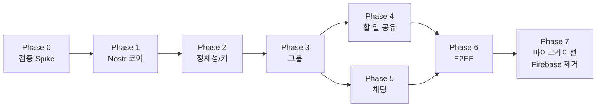

# 03. 구현 계획

> **확정 전제 ([04-open-questions.md](04-open-questions.md) D1~D4)**
> - **D1** 그룹 = NIP-29 릴레이 관리형
> - **D2** 릴레이 = 자체 운영(GCP e2-micro) + 공개 릴레이 병행 → [05-relay-operations.md](05-relay-operations.md)
> - **D3** 라이브러리 = 직접 구현, 외부 의존성은 `swift-secp256k1` 하나뿐. NIP-44는 Phase 6로 미룸
> - **D4** 마이그레이션 = 클린 스타트 (uid↔npub 매핑·이중 쓰기 없음)
>
> 각 Phase는 **독립적으로 머지 가능하고, 이전 Phase로 되돌릴 수 있어야 한다.** Firebase 코드는 Phase 7까지 지우지 않는다.

---

## 전체 흐름



Phase 4와 5는 병렬 가능. **Phase 0에서 막히면 설계를 다시 잡는다 — 여기서 시간을 아끼면 안 된다.**

---

## Phase 0 — 검증 Spike (앱 코드 0줄)

**목적**: 설계의 전제 3가지가 실제로 성립하는지 확인. 안 되면 A안을 버리고 B안으로 간다.

**작업**

1. 로컬 릴레이 기동
   ```bash
   # khatru29 예시 — Docker로 로컬 기동
   docker run -p 3334:3334 <khatru29 image>   # 또는 go run
   ```
2. `nak`으로 왕복 확인
   ```bash
   nak key generate                                  # 관리자 키
   nak event -k 9007 -t h=testgroup --sec $ADMIN ws://localhost:3334      # 그룹 생성
   nak req -k 39000 -k 39002 ws://localhost:3334                          # 릴레이가 발행한 메타 확인
   nak event -k 9 -t h=testgroup -c "hi" --sec $ADMIN ws://localhost:3334 # 채팅
   nak event -k 31700 -t d=todomate:v1:todos:2026-08-02 -t h=testgroup \
       -c '{"todos":[]}' --sec $ADMIN ws://localhost:3334                 # ★ 커스텀 kind
   nak req -k 31700 -a $ADMIN_PUB ws://localhost:3334
   ```
3. 비멤버 키로 같은 그룹에 쓰기 시도 → **거부되는지 확인**
4. NIP-42 AUTH를 켜고 비인증 구독이 막히는지 확인

5. **e2-micro 배포 리허설** — 맥에서 `GOOS=linux go build` → VM 업로드 → Caddy 리버스 프록시 뒤에 `wss://`로 붙이고 맥에서 접속 확인 ([05-relay-operations.md §4](05-relay-operations.md))

**검증 항목 (Go/No-Go)**

| # | 확인할 것 | 실패 시 |
|---|---|---|
| 1 | NIP-29 릴레이가 **커스텀 kind 31700**을 `h` 태그와 함께 받아주는가 | khatru의 `RejectEvent`에 예외 추가 (Go 몇 줄) or 스냅샷을 kind 30078(NIP-78)로 변경 |
| 2 | 비멤버 쓰기를 릴레이가 거부하는가 | A안(D1)이 무의미해짐 → B안 재검토 |
| 3 | NIP-42로 읽기 제한이 되는가 | 그룹 데이터가 공개됨 → Phase 6 암호화를 앞당김 |
| 4 | 이벤트 id/서명 직렬화가 릴레이에 수락되는가 | `nak`이 만든 이벤트와 바이트 단위 비교 |
| 5 | **e2-micro에서 khatru29가 안정적으로 뜨는가** (메모리·WSS 경유) | 다른 호스팅 검토. strfry는 1GB에서 빌드가 어려우므로 Docker 이미지 사용 |
| 6 | 기존 서버와 포트/TLS 충돌이 없는가 | 서브도메인 분리 |

**산출물**: `docs/nostr/00-spike-result.md` (검증 결과 + kind 번호 확정 + 릴레이 설정 확정)
**예상**: 2~3일 (릴레이 배포 포함)

---

## Phase 1 — `TodoMateNostr` 코어 패키지

**목적**: 앱과 무관하게 "이벤트를 만들고 서명하고 릴레이와 주고받는" 계층을 완성. 이 Phase의 산출물은 전부 `swift test`로 검증 가능해야 한다.

**작업**

| 모듈 | 내용 |
|---|---|
| `Event/` | `NostrEvent` 구조체, NIP-01 직렬화, `id` 계산, 서명 검증, `Filter` 타입 |
| `Crypto/` | Schnorr 서명 (swift-secp256k1), bech32 (NIP-19: `npub`/`nsec`/`naddr`) |
| `Relay/` | `RelayConnection`(`URLSessionWebSocketTask`), `RelayPool`, `Subscription` 관리, 재연결(지수 백오프), `OK`/`EOSE`/`CLOSED` 처리, 이벤트 dedup |
| `Signer/` | `NostrSigner` 프로토콜 + 인메모리 구현 (Keychain은 Phase 2) |

**Swift 관례 준수** (`.agent/rules/project-rules.md`)
- Swift 6.2 strict concurrency. `RelayPool`은 `actor`, 콜백 금지 → `AsyncStream`
- `@Observable` 상태 객체는 `@MainActor`
- 콜백 대신 `async/await`

```swift
// 시그니처 스케치
public actor RelayPool {
  public func connect(to urls: [URL], purpose: RelayPurpose) async
  public func disconnectAll() async

  /// 용도별 라우팅 — 그룹 데이터가 공개 릴레이로 새는 것을 타입으로 막는다
  public func publish(_ event: NostrEvent, to purpose: RelayPurpose) async -> [URL: PublishResult]
  public func subscribe(_ filters: [Filter], on purpose: RelayPurpose) -> AsyncStream<SubscriptionEvent>
}

public enum RelayPurpose: Sendable {
  case group      // 자체 릴레이 전용 (kind 9, 31700, 9007/9021/9022, 39000~)
  case metadata   // 자체 + 공개 (kind 0, 10002)
}

public enum SubscriptionEvent: Sendable {
  case event(NostrEvent)
  case endOfStoredEvents          // EOSE — 여기서부터 실시간
  case closed(reason: String)
  case failure(any Error)
}
```

> **`RelayPurpose`를 Phase 1에서 빼먹으면 안 된다.** 나중에 추가하면 그때까지 공개 릴레이로 나간 그룹 이벤트를 회수할 수 없다 (D2, [05-relay-operations.md §1](05-relay-operations.md)).

> **`since` 커서 기반 증분 동기화도 Phase 1에서 넣는다.** e2-micro의 월 1GB 이그레스에서 가장 큰 항목이 "앱 시작 시 전체 이력 재수신"이다 ([05-relay-operations.md §2](05-relay-operations.md)).

**완료 기준**
- [ ] NIP-01 테스트 벡터로 `id` 계산·서명·검증 통과
- [ ] bech32 인코딩/디코딩 왕복 테스트 통과
- [ ] 로컬 릴레이 상대로 발행 → 구독 → 수신 통합 테스트 통과
- [ ] 연결이 끊겼다 붙었을 때 구독이 자동 복구되는 테스트 통과
- [ ] `.group` 이벤트가 `.metadata` 릴레이로 전송되지 않음을 검증하는 테스트
- [ ] `since` 커서로 재구독 시 이미 받은 이벤트를 다시 받지 않음
- [ ] `just test-nostr` 추가

**리스크**: 이벤트 직렬화 미세 차이로 릴레이가 거부. → Phase 0의 `nak` 출력과 바이트 단위 비교.
**예상**: 2~3주 (D3에 따라 직접 구현. 이 프로젝트에서 가장 긴 구간)

---

## Phase 2 — 정체성 (로그인 대체)

**목적**: Google 로그인을 키 기반으로 교체. 앱이 "로그인된 상태"를 가질 수 있게 한다.

**작업**
- `KeychainNostrSigner` — macOS Keychain 저장/조회/삭제
- `NostrKeyService` — 키 생성 / `nsec` 가져오기 / NIP-49(`ncryptsec`) 내보내기·가져오기
- `AuthService` 구현체 교체 (`signedInUserId` → pubkey hex)
- `NostrProfileRepository` — kind 0 발행/조회 → `UserRepository` 대체
- **온보딩 UI**: 키 생성 → **백업 강제 유도** → 프로필 이름 설정
- `LoginView` / `SettingView`(`EditDisplayNameSheet`) 수정

**완료 기준**
- [ ] 앱 재시작 후에도 키가 유지되고 `SessionStore.authState == .authenticated`
- [ ] `nsec` 가져오기로 다른 기기에서 같은 계정 진입
- [ ] `ncryptsec` 내보내기/가져오기 왕복
- [ ] 프로필 이름 변경이 릴레이에 반영되고 다른 기기에서 보임
- [ ] **키 백업을 하지 않으면 계정을 잃는다는 경고가 온보딩에 명시**

**리스크 (최상위)**: 사용자가 키를 잃어버리는 것. UX가 이 Phase의 본체다.
- 온보딩에서 백업 파일 저장을 건너뛸 수 없게 하거나, 건너뛰면 배지로 계속 경고
- 설정에 "키 백업" 항목 상시 노출

---

## Phase 3 — 그룹

**목적**: `createGroup` / `joinGroup` / `leaveGroup` / 멤버 목록을 NIP-29로 재구현. UI는 그대로 둔다.

**작업**
- `Nip29GroupRepository`
  - 생성 → kind **9007**, 메타데이터 → **9002**
  - 가입 → kind **9021**, 탈퇴 → **9022**
  - 그룹 정보 → kind **39000** 구독, 멤버 → **39002** 구독
  - 초대 코드 → kind **9009**
- `GroupRepository` 프로토콜에서 `userRepository` 파라미터 제거 (트랜잭션 불필요)
- `SessionStore.groupMembers`를 39002 + 멤버들의 kind 0 조회로 채움
- `GroupFeedNoGroupView`의 "Group ID" 입력을 **초대 코드/`naddr`** 입력으로 확장

**완료 기준**
- [ ] A 기기에서 그룹 생성 → 초대 코드 발급 → B 기기에서 가입 → 양쪽 멤버 목록 일치
- [ ] 탈퇴 시 멤버 목록에서 제거되고 이후 그룹 쓰기가 거부됨
- [ ] 멤버 표시 이름(kind 0)이 `AvatarPile` / `UserProfile`에 정상 표시
- [ ] 릴레이 재연결 후 그룹 상태 자동 복구

**리스크**: 그룹이 릴레이에 귀속 → 릴레이 장애 시 그룹 기능 중단. 로컬 캐시로 "읽기는 되게" 유지.

---

## Phase 4 — 할 일 공유 (그룹 피드)

**목적**: `SyncTodayTodosUseCase`(Firestore 양방향 동기화)를 **"내 스냅샷 발행 + 남의 스냅샷 구독"** 단방향 모델로 교체.

**작업**
- `SDGroupSnapshot` — 남의 스냅샷 캐시용 SwiftData 모델 (개인 `SDTodo`와 분리)
- `NostrTodoSnapshotRepository`
  - 발행: 로컬 오늘 Todo → kind **31700** (`d`=날짜, `h`=그룹), **debounce 2초**
  - 구독: `{kinds:[31700], authors:[멤버], "#d":[날짜들]}`
- `PublishDailySnapshotUseCase` 신설, `SyncTodayTodosUseCase` 대체
- 아웃박스 큐 (SwiftData) + 지수 백오프 재시도
- `TodoStore`를 구독 기반으로 전환 → **`observeTodos`가 실제로 동작** (현재는 빈 스트림)
- `fetchCount` 계열을 로컬 계산으로 이전

**완료 기준**
- [ ] A가 Todo를 수정하면 B의 피드가 **수동 새로고침 없이** 갱신됨
- [ ] Todo 삭제가 상대 피드에도 반영됨 (묶음 재발행)
- [ ] 오프라인에서 수정 → 온라인 복귀 시 자동 발행
- [ ] Todo 5개 연속 수정 시 이벤트가 1~2개만 발행됨 (debounce 검증)
- [ ] 기존 `HomeView`/`BoardView`/`CalendarView`(개인, 로컬) 동작에 변화 없음

**리스크**: 스냅샷 묶음이 커지면 이벤트 크기 초과. → 릴레이 `max_message_length`(NIP-11) 확인, 하루 Todo 수 상한 정책.

---

## Phase 5 — 채팅

**목적**: `v2-group_messages` → kind 9.

**작업**
- `NostrChatRepository` — 발행(kind 9, `h` 태그), 구독(`{kinds:[9], "#h":[groupId], since:커서}`)
- `RepositoryEvent` 매핑 (§02-7.3)
- 이력 로딩: `until` + `limit` 기반 페이지네이션
- 로컬 메시지 캐시 (오프라인 열람)
- `MessageRepository.update` 제거 (미사용)
- `MessageReadTracker`는 그대로

**완료 기준**
- [ ] 양방향 실시간 송수신
- [ ] 앱 재시작 후 이력 복원 (로컬 캐시 + `since` 재구독)
- [ ] 중복 메시지 없음 (`id` dedup)
- [ ] 오프라인 전송 → 복귀 시 발송
- [ ] 미읽음 배지 정상 동작

---

## Phase 6 — E2EE (선택, Q6에 따라)

**목적**: 릴레이 운영자도 내용을 못 보게.

**작업**
- NIP-44 v2 구현 또는 SDK 사용 (ChaCha20 + HMAC-SHA256, HKDF, 패딩)
- 그룹 전용 키쌍 생성, NIP-17 gift wrap으로 멤버에게 배포
- kind 9 / 31700의 `content`를 그룹 키로 암호화 (**태그는 평문 유지**)
- 키 로테이션: 멤버 제거 시 새 키 생성 → 남은 멤버에게 재배포
- 마이그레이션: 평문 이벤트와 암호문 이벤트 공존 처리 (버전 태그)

**완료 기준**
- [ ] NIP-44 공식 테스트 벡터 통과
- [ ] 그룹 키 없는 관찰자가 `content`를 복호화하지 못함
- [ ] 멤버 제거 후 그 멤버가 새 메시지를 못 읽음

**리스크**: 암호화 구현 오류. → 반드시 공식 테스트 벡터로 검증하고, 직접 구현이면 코드 리뷰 필수.

---

## Phase 7 — 전환 및 Firebase 제거 (클린 스타트)

**D4에 따라 이중 쓰기·uid↔npub 매핑 코드는 작성하지 않는다.** 이 Phase가 대폭 축소된다.

**작업**
1. **전환 안내 UI**: "그룹을 새로 만들어야 하고, 기존 그룹 채팅 이력은 이전되지 않는다"를 릴리스 노트와 앱 내에서 명시
2. **그룹 재생성**: 관리자가 Nostr 그룹을 만들고 초대 코드를 배포. 자동 이주는 하지 않음
3. **데이터**: 개인 Todo/Memo는 이미 SwiftData에 있으므로 **이관 작업 없음**. 실제로 포기하는 것은 기존 그룹 채팅 이력뿐
4. **제거**: Firebase Auth / Firestore SDK, GoogleSignIn, `GoogleService-Info.plist`, `FirebaseConfig/`, `FirebaseEmulator/`, `Firestore*RepositoryImpl`, `NetworkController`의 Firestore 구현
5. **`LegacyImportRepository`는 남긴다** (구 사용자 데이터 이전 기능). Firebase 의존이 이것 하나 때문에 남는다면, 임포트 기능을 JSON 파일 기반으로 바꿔 Firebase를 완전히 걷어낼지 별도 판단
6. 문서 갱신: `README.md`, `GEMINI.md`, `docs/app-information.md`, `justfile`(에뮬레이터 타깃 제거)

**완료 기준**
- [ ] Firebase SDK 없이 빌드 성공
- [ ] `just test-all` 통과 (에뮬레이터 의존 타깃이 릴레이 타깃으로 교체됨)
- [ ] 앱 용량·기동 시간 비교 기록

---

## 테스트 전략

Firebase 에뮬레이터가 하던 역할을 **로컬 릴레이**가 그대로 대체한다.

| 계층 | 대상 | 도구 |
|---|---|---|
| 단위 | 이벤트 직렬화, 서명, bech32, NIP-44 | `swift test` (TodoMateNostr) — 릴레이 불필요 |
| 통합 | Repository 구현체 | 로컬 릴레이 (Docker) |
| 앱 | Store/UseCase | 기존 Stub 패턴 유지 (`StubGroupRepository` 등 재사용) |
| E2E | 2기기 시나리오 | 릴레이 1개 + 클라이언트 2개 |

**justfile 추가 (제안)** — 기존 `start-emulator`/`stop-emulator` 패턴과 동일하게:

```make
start-relay:
    @echo "🛰️  Starting local Nostr relay..."
    @docker compose -f NostrRelay/docker-compose.yml up -d

stop-relay:
    @docker compose -f NostrRelay/docker-compose.yml down

test-nostr:
    cd TodoMateNostr && swift test

test-nostr-integration: start-relay
    cd TodoMateNostr && swift test --filter RelayIntegrationTests
    just stop-relay
```

**Stub 자산은 그대로 쓸 수 있다.** `PublicDIContainer.preview` / `.mock(...)`이 프로토콜 기반이므로 프리뷰·테스트는 전환의 영향을 거의 안 받는다.

---

## 리스크 레지스터

| # | 리스크 | 영향 | 확률 | 완화 |
|---|---|---|---|---|
| R1 | **사용자가 개인키를 분실** | 계정 영구 상실 | 높음 | 온보딩 백업 강제, 상시 경고, `ncryptsec` 파일 + 니모닉 |
| R2 | 릴레이 장애/비용 | 그룹 기능 중단 | 중 | 로컬 캐시로 읽기 유지, 다중 릴레이(NIP-65), 모니터링 |
| R3 | NIP-29 릴레이가 커스텀 kind 거부 | 설계 변경 | 중 | **Phase 0에서 선검증**, 대안 kind 30078 |
| R4 | 이벤트 직렬화/서명 버그 | 전부 거부됨 | 중 | 테스트 벡터, `nak` 대조 |
| R5 | 직접 구현(D3)으로 Phase 1이 길어짐 | 일정 지연 | 높음 | 범위를 "동작하는 최소"로 제한. NIP-44는 Phase 6로 분리 |
| R6 | NIP-44 구현 오류 | 프라이버시 붕괴 | 중 | 공식 테스트 벡터, Phase 6까지 미루기 |
| R7 | 스팸·악성 이벤트 | 피드 오염 | 낮음 | NIP-42 화이트리스트, 멤버만 쓰기 |
| R8 | 클린 스타트로 인한 채팅 이력 상실 | 사용자 불만 | 확정 | 릴리스 노트·앱 내 안내 (D4로 감수하기로 결정) |
| **R9** | **릴레이 DB 유실 → 그룹 소실** | **그룹 영구 상실** | 중 | NIP-29에서는 멤버십이 릴레이에만 존재한다. **Phase 3 전에 일 1회 백업 필수** ([05](05-relay-operations.md) §5) |
| R10 | e2-micro 월 1GB 이그레스 초과 | 과금 | 낮음(소규모) | `since` 증분 동기화, GCP 예산 알림. 사용자 수에 선형 증가 |
| R11 | 그룹 데이터가 공개 릴레이로 유출 | 회수 불가 | 중 | `RelayPurpose` 라우팅을 Phase 1부터 + 전용 테스트 |

---

## 진행 방식 제안

- Phase당 GitHub 이슈 1개 + 브랜치 1개 (`feature/nostr-<phase>`), `dev`로 `--no-ff` 머지 (`.agent/rules/git-conventions.md`)
- Phase마다 `just build` + 해당 테스트 통과를 머지 조건으로
- Phase 0 결과에 따라 이 문서를 갱신한 뒤 Phase 1 착수

---

## 다음

→ [04-open-questions.md](04-open-questions.md): 착수 전에 결정해야 할 것들
</content>
