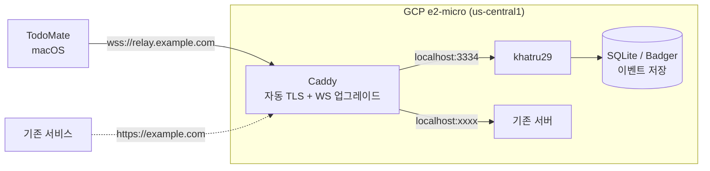

# 05. 릴레이 운영 (GCP e2-micro)

> 결정 D2: **자체 릴레이 = 그룹 데이터의 권위 있는 저장소, 공개 릴레이 = 공개 메타데이터 배포용.**
> 기존에 간단한 서버가 도는 GCP e2-micro(Always Free) VM을 재활용한다.

---

## 1. 역할 분리 — 무엇을 어디로 보내는가

**핵심 원칙: 그룹 데이터는 자체 릴레이 밖으로 나가지 않는다.**

| 이벤트 | 자체 릴레이 | 공개 릴레이 | 이유 |
|---|---|---|---|
| kind **0** 프로필 | ✓ | ✓ | 공개 정보. 다른 Nostr 클라이언트에서도 프로필이 보임 |
| kind **10002** 릴레이 목록 (NIP-65) | ✓ | ✓ | 멤버 발견에 필요. 공개돼야 의미가 있음 |
| kind **9** 그룹 채팅 (`h` 태그) | ✓ | **✗** | 그룹 내용. 공개 릴레이는 어차피 NIP-29 문맥이 없어 무의미 |
| kind **31700** 할 일 스냅샷 (`h` 태그) | ✓ | **✗** | 그룹 내용 + 커스텀 kind라 공개 릴레이가 거부/프루닝 |
| kind **9007/9021/9022** 그룹 관리 | ✓ | **✗** | NIP-29 릴레이만 해석 가능 |
| kind **39000~39003** 그룹 상태 | ✓ (릴레이가 발행) | **✗** | 릴레이가 만들어 주는 것 |
| kind **1059** gift wrap (Phase 6 초대) | ✓ | ✓ | 수신자가 어느 릴레이를 볼지 모르므로 넓게 뿌리는 게 유리 |

**구현 반영**: `RelayPool`은 단일 목록이 아니라 **용도별 라우팅**을 지원해야 한다.

```swift
public enum RelayPurpose: Sendable {
  case group      // 자체 릴레이 전용
  case metadata   // 자체 + 공개
}

public actor RelayPool {
  public func publish(_ event: NostrEvent, to purpose: RelayPurpose) async -> [URL: PublishResult]
}
```

이 분리를 Phase 1부터 넣어두지 않으면 나중에 그룹 데이터가 공개 릴레이로 새어 나간다. **되돌리기 어려운 종류의 실수**다 (한 번 나간 이벤트는 회수 불가).

---

## 2. e2-micro의 실제 제약

[Always Free 공식 사양](https://cloud.google.com/free/docs/free-cloud-features) 기준:

| 자원 | 무료 한도 | 릴레이에 미치는 영향 |
|---|---|---|
| 인스턴스 | e2-micro 1대 (2 vCPU **공유**, **1GB RAM**) | 소규모 릴레이에는 충분. 단 아래 §3의 빌드 문제 주의 |
| 리전 | `us-west1` / `us-central1` / `us-east1` **만** | 한국에서 접속 시 RTT ~150~200ms. 채팅 체감에 영향은 있으나 사용 가능한 수준 |
| 디스크 | 표준 영구 디스크 30GB | 이벤트 저장에 충분. 단 무한 증가하므로 §5 프루닝 필요 |
| **이그레스** | **북미 → 전 지역 월 1GB** (중국·호주 제외) | ★ 가장 빡빡한 한도. 아래 예산 계산 참고 |

### 이그레스 예산 계산

WebSocket 릴레이의 아웃바운드는 "이벤트 크기 × 구독 중인 멤버 수"로 늘어난다.

| 항목 | 크기 | 하루 발생량(5인 그룹 가정) | 팬아웃 | 월 이그레스 |
|---|---|---|---|---|
| 채팅 (kind 9) | ~400 B | 100건 | ×4 | ~4.8 MB |
| 할 일 스냅샷 (kind 31700) | ~2 KB | 50건 (debounce 후) | ×4 | ~12 MB |
| 앱 시작 시 이력 동기화 | ~200 KB | 인당 3회 | — | ~90 MB |
| TLS 핸드셰이크·재연결·ping | — | — | — | ~20 MB |
| **합계** | | | | **~130 MB/월** |

→ **5인 규모에서는 1GB 한도의 15% 수준.** 여유 있다.
→ 다만 **사용자 수에 대략 선형**으로 증가한다. 30~40명을 넘어가면 한도에 닿는다.

**대응**
- `since` 커서 기반 증분 동기화를 **Phase 1부터** 구현한다 (매번 전체 이력을 받지 않도록). 위 표에서 가장 큰 항목이 이력 동기화다.
- GCP 콘솔에 **예산 알림**을 걸어둔다 (무료 한도 초과 시 과금).
- 한도를 넘기면 초과분 이그레스 요금은 GB당 몇 센트 수준이라 파산할 일은 없지만, 모르고 방치하면 안 된다.
- 참고: Standard 네트워크 티어에 별도의 무료 데이터 전송 허용량이 있다는 이야기가 있으나 **공식 Always Free 문서에는 1GB만 명시**되어 있다. 실제 적용 여부는 결제 콘솔에서 직접 확인할 것.

---

## 3. 릴레이 구현체 선택: khatru29 (Go) 권장

| | [khatru](https://github.com/fiatjaf/khatru) + [relay29](https://github.com/fiatjaf/relay29) | [strfry](https://github.com/hoytech/strfry) + strfry29 |
|---|---|---|
| 언어 | Go | C++ |
| 빌드 | 단일 정적 바이너리. 로컬 크로스컴파일 후 업로드 가능 | **1GB RAM에서 컴파일 실패 가능** (C++ 빌드가 메모리를 많이 씀). Docker 이미지나 외부 빌드 필요 |
| 런타임 메모리 | 작음 | LMDB 메모리 매핑. 소규모면 문제없음 |
| 정책 커스터마이징 | `RejectEvent`/`RejectFilter`를 Go 코드로 직접 작성 | 설정 + 플러그인(외부 프로세스) |
| NIP-29 | `khatru29` 래퍼 | `strfry29` |

**e2-micro 환경에서는 khatru29가 명확히 낫다.** 이유:
1. Go 크로스컴파일로 **맥에서 빌드해서 바이너리만 올리면 된다** — VM에서 컴파일할 필요가 없음.
2. Phase 0에서 "커스텀 kind 31700을 `h` 태그와 함께 허용" 정책이 필요할 수 있는데, khatru는 그걸 **Go 함수 몇 줄로** 넣을 수 있다. strfry는 플러그인 프로세스를 따로 띄워야 한다.
3. 메모리 여유가 적은 환경에서 예측 가능성이 높다.

```bash
# 맥에서 빌드 → VM으로 전송 (VM에서 컴파일 안 함)
GOOS=linux GOARCH=amd64 go build -o relay ./cmd/relay
gcloud compute scp relay <instance>:~/ --zone us-central1-a
```

---

## 4. 배포 구성

기존에 다른 서버가 이미 80/443을 쓰고 있으므로 **리버스 프록시로 합류**시킨다.



**Caddy를 권장하는 이유**: 자동 TLS(Let's Encrypt)와 WebSocket 업그레이드가 기본이라 설정이 몇 줄이다. nginx면 `proxy_set_header Upgrade/Connection`을 직접 써야 한다.

```caddyfile
relay.example.com {
    reverse_proxy localhost:3334
}
```

**방화벽**: GCP VPC에서 443만 열고, 릴레이 포트(3334)는 외부에 노출하지 않는다.

**접근 통제 (NIP-42)**: 그룹이 `private`이면 읽기에도 AUTH가 필요하다. khatru29에서 인증된 pubkey가 그룹 멤버인지 확인하는 `RejectFilter`를 넣는다. → **Phase 0의 검증 항목 3번**이 바로 이것.

---

## 5. 운영 항목

| 항목 | 내용 | 언제 |
|---|---|---|
| **백업** ★ | NIP-29에서는 **그룹 멤버십(39000~39003)이 릴레이에만 존재한다.** 릴레이 DB가 날아가면 그룹이 사라진다. 앱의 로컬 캐시로 읽기는 되지만 복구는 안 된다 | Phase 3 전에 필수. 일 1회 DB 스냅샷 → GCS 또는 별도 디스크 |
| 프루닝 | 오래된 채팅·스냅샷 정리 정책. 30GB를 채우기 전에 | Phase 5 이후 |
| 모니터링 | 프로세스 살아있는지, 디스크 사용량, 이그레스 | Phase 3 |
| 예산 알림 | GCP Billing 예산 알림 (무료 한도 초과 감지) | 배포 즉시 |
| 재시작 | `systemd` 유닛으로 등록해 VM 재부팅 시 자동 기동 | 배포 시 |
| 백업 릴레이 | 단일 장애점이다. 여유가 생기면 두 번째 릴레이에 그룹 미러링 검토 | 나중 |

> **가장 중요한 것은 백업이다.** "릴레이에 멤버십을 맡긴다"는 D1의 결정이 곧 "릴레이 DB가 그룹의 진실"이라는 뜻이다.
> 개인 데이터는 SwiftData에 있어 안전하지만, **그룹은 릴레이와 함께 사라진다.**

---

## 6. 개발용 로컬 릴레이

`FirebaseEmulator/`가 하던 역할을 그대로 대체한다.

```
NostrRelay/
├── docker-compose.yml     # 로컬 khatru29
├── relay.config           # 테스트용 정책 (AUTH 끔, 화이트리스트 없음)
└── README.md
```

```make
# justfile 추가
start-relay:
    @echo "🛰️  Starting local Nostr relay..."
    @docker compose -f NostrRelay/docker-compose.yml up -d

stop-relay:
    @docker compose -f NostrRelay/docker-compose.yml down
```

**프로덕션 설정을 로컬에 복사하지 않는다.** 로컬은 AUTH를 끄고 아무 키나 받게 해서 테스트를 단순하게 유지한다. 단 **Phase 0에서 AUTH/화이트리스트 동작만은 프로덕션과 동일한 설정으로 한 번 검증**해야 한다.

---

## 참고

- [GCP Always Free 사양](https://cloud.google.com/free/docs/free-cloud-features)
- [khatru](https://github.com/fiatjaf/khatru) / [relay29](https://github.com/fiatjaf/relay29)
- [strfry 호스팅 가이드](https://usenostr.org/relay.html)
- [NIP-42 AUTH](https://github.com/nostr-protocol/nips/blob/master/42.md)
</content>
