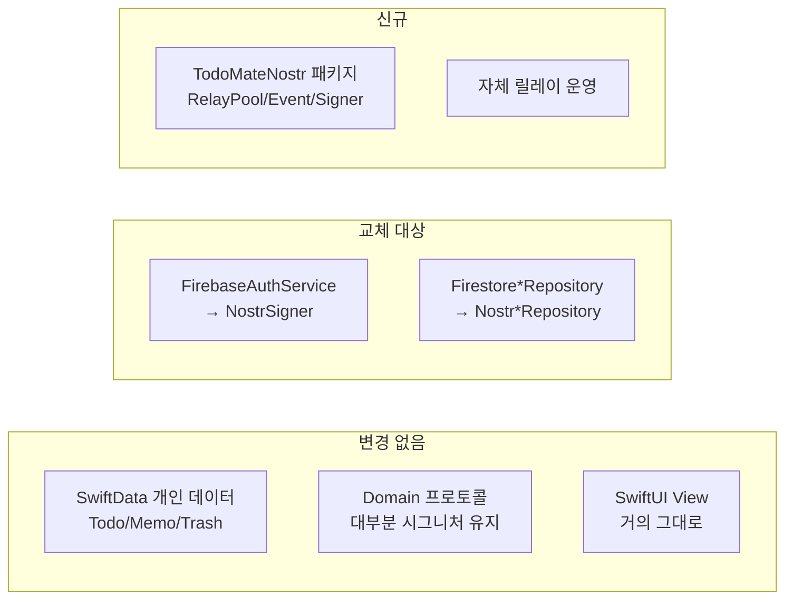

# Nostr 기반 그룹/데이터 공유 전환

TodoMate의 **그룹 및 데이터 공유 기능**을 Firebase(Auth + Firestore)에서 **Nostr**로 옮기기 위한 조사·설계·계획 문서 모음입니다.

개인 데이터(SwiftData)는 **그대로 로컬에 유지**하고, 그룹 관련 통신만 Nostr로 대체하는 것이 전제입니다.

## 문서 구성

| 문서 | 내용 | 대상 |
|------|------|------|
| [01-nostr-primer.md](01-nostr-primer.md) | Nostr를 쓰기 전에 반드시 알아야 할 것 (이벤트/kind/릴레이/NIP/함정) | 개념 학습 |
| [02-architecture.md](02-architecture.md) | TodoMate에 맞춘 설계 — 그룹 모델 비교, 이벤트 스키마, 레이어 매핑 | 설계 |
| [03-implementation-plan.md](03-implementation-plan.md) | Phase 0~7 단계별 작업 계획, 테스트/전환 전략 | 실행 |
| [04-open-questions.md](04-open-questions.md) | 확정된 결정(D1~D4)과 남은 질문 | 의사결정 |
| [05-relay-operations.md](05-relay-operations.md) | GCP e2-micro 릴레이 운영 — 사양 제약, 배포, 백업 | 인프라 |

## 확정된 결정 (2026-08-02)

| | 결정 | 근거 |
|---|---|---|
| **D1 그룹 모델** | **NIP-29 릴레이 관리형** | 멤버십·초대·강퇴를 릴레이가 처리 → 현재 도메인 모델과 거의 1:1 매핑, 작업량 최소 |
| **D2 릴레이** | **자체 운영(GCP e2-micro) + 공개 릴레이 병행** | 그룹 데이터는 자체 릴레이만, 공개 릴레이는 프로필(kind 0)·릴레이 목록(10002)만 |
| **D3 라이브러리** | **직접 구현 + `swift-secp256k1`만** | 의존성 최소화. NIP-44는 Phase 6로 분리해 Phase 1 범위를 줄임 |
| **D4 마이그레이션** | **클린 스타트** | 개인 데이터는 이미 로컬에 있음. 이중 쓰기 코드 불필요, Phase 7 축소 |

## 30초 요약

**Nostr가 무엇인지 한 줄로**: 계정 = secp256k1 키쌍, 데이터 = 서명된 JSON 이벤트, 서버 = WebSocket 릴레이(저장·중계만 하고 로직 없음).

**핵심 결론 5가지**

1. **Nostr는 Firestore의 대체재가 아니다.** 릴레이는 보존을 보장하지 않고, 트랜잭션·집계·서버 규칙이 없다.
   → SwiftData를 진실의 원천(source of truth)으로 두고, **Nostr는 전송/동기화 계층**으로만 쓴다. (지금 방향과 일치)
2. **로그인 방식이 근본적으로 바뀐다.** Google 로그인 → 개인키(nsec) 생성/보관. 계정 복구가 불가능하므로 키 백업 UX가 이 프로젝트에서 가장 위험한 부분이다.
3. **릴레이 DB가 곧 그룹이다.** NIP-29를 택했으므로 그룹 멤버십이 릴레이에만 존재한다. **릴레이 백업이 Phase 3 이전의 필수 작업**이다.
4. **얻는 것**: 실시간 구독이 프로토콜 기본이라 지금 미구현 상태인 `observeTodos`(그룹 피드 실시간 갱신)를 공짜로 얻는다. E2EE도 가능해진다. Firebase 무료 티어 한계에서 벗어난다.
   **잃는 것**: 서버 강제 규칙, 카운트 집계, "수정/삭제" 개념, 기존 그룹 채팅 이력(D4).
5. **작업량의 대부분은 Phase 1(Nostr 코어 직접 구현, 2~3주)과 §02-8의 임피던스 미스매치 표에 있다.**

**변경 범위 (레이어별)**

## 지금 상태에서 다음 액션

D1~D4가 확정되었으므로 **[Phase 0 — 검증 Spike](03-implementation-plan.md#phase-0--검증-spike-앱-코드-0줄)** 착수 가능.
앱 코드는 한 줄도 쓰지 않고, 로컬 + e2-micro에 khatru29를 띄워 `nak` CLI로 6가지 Go/No-Go 항목을 확인하는 2~3일짜리 작업이다.
여기서 막히면(특히 커스텀 kind 31700 수용 여부) 설계를 다시 잡아야 하므로 **반드시 먼저 한다.**

문서 작성 시점: 2026-08-02 (NIP 명세와 라이브러리 상태는 이 시점 기준)
</content>
</invoke>
