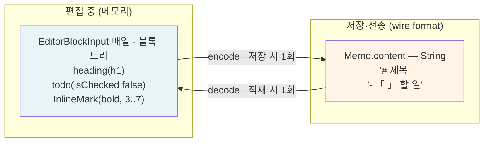

# 03. 저장 표현형(wire format) 결정

> **D4: 마크다운을 wire format으로 쓰고, `Memo.content: String`을 유지한다.**

---

## 1. wire format이 뭔가

**wire format = 데이터가 저장·전송될 때의 표현형**이다. 같은 데이터인데 사는 곳마다 모양이 다르다.



*(위 다이어그램의 `「 」`는 다이어그램 파싱 문제를 피하기 위한 표기이고, 실제 저장 문자열은 `- [ ] 할 일` 이다.)*

블록 에디터는 **트리**를 다루는데 TodoMate의 저장소는 **`String`**을 쓴다. 이 둘을 뭘로 이을 것인가 — 그게 wire format 결정이다.

"마크다운을 wire format으로 쓴다"는 말은:
> **엔진 밖으로 나갈 때만 마크다운으로 접었다 펴고, 편집 중에는 블록 트리로 산다.**
> 변환은 딱 두 지점(적재 1회 / 저장 1회)에서만 일어난다. 타이핑 경로에는 없다. ([§02-7](02-interface-design.md#7-저장-이벤트-처리))

---

## 2. 왜 이게 결정 사항인가 — `Memo.content`의 소비자들

`Memo.content`는 `String` 하나인데, **6곳이 이걸 직접 읽는다.**

| 소비자 | 하는 일 | 마크다운이면 | JSON이면 |
|---|---|---|---|
| `MemoGridItem` | `components(separatedBy: .newlines)`로 8줄 미리보기 | ✅ 사람이 읽는 텍스트 | ❌ `{"blocks":[{"i...` |
| `MemoGridItem` | `pasteboard.setString(memo.content)` — 클립보드 복사 | ✅ 붙여넣으면 정상 텍스트 | ❌ JSON 덩어리 |
| `MemoEntity` (App Intents) | Spotlight/단축어에 노출 | ✅ | ❌ |
| `TodoMateWidget` | 위젯 본문 표시 | ✅ | ❌ |
| `MemoRecord` (GRDB) | 로컬 영속화 | ✅ | ✅ |
| `MemoRepositoryImpl` (Firebase) | 원격 동기화 | ✅ | ✅ |
| `Memo.wordCount` / `isEmpty` | 단어 수, 빈 메모 판정 | ✅ 대체로 맞음 | ❌ 항상 non-empty |

여기에 마이그레이션이 붙는다: 기존 메모는 전부 평문/마크다운 `String`이다. JSON으로 가면 **모든 기존 메모를 변환하거나, 두 포맷을 동시에 읽는 코드를 유지**해야 한다.

> `Memo.stub`이 이미 마크다운이다:
> `"# 샘플 메모\n\n- 첫 번째 항목\n...\n**볼드 텍스트**와 *이탤릭 텍스트*"`
> 사실상 마크다운을 wire format으로 쓰기로 이미 절반쯤 결정되어 있었다.

---

## 3. 먼저: 다른 블록 에디터들은 어떻게 하나

**정직하게: Notion과 Craft는 이 방식을 쓰지 않는다.** 이 결정이 업계 표준이 아니라는 걸 알고 채택하는 것이 중요하다.

| 앱 | 저장 시 정본(canonical) | 마크다운의 위치 |
|---|---|---|
| **Notion** | 구조화 블록 레코드 (`type` + `properties` + 자식 id). 리치 텍스트는 `[내용, [주석...]]` 배열 | import/export 전용 |
| **Craft** | 구조화 블록 문서 | 잘 만든 export/import, 저장 포맷은 아님 |
| **Obsidian / Bear / Logseq** | **마크다운 파일 자체가 정본** | 정본 |
| **Apple Notes** | 구조화/바이너리 | 부분 지원 |

갈리는 축은 **"문서가 제품인가, 사용자가 소유한 파일인가"**다. Notion·Craft는 블록 참조·백링크·per-block 코멘트·실시간 협업을 파는 제품이라 **블록 ID가 영구히 살아야 한다.** 마크다운은 블록 ID를 표현하지 못하므로 애초에 후보가 아니다.

Slopad의 ROADMAP도 같은 편이다:
> *"Keep markdown as import/export format and input shortcut syntax, **not canonical state**"* (P3)

### TodoMate가 어디에 서는가

정확히 짚으면:

- **편집 중에는 TodoMate도 Notion 방식이다.** 블록 트리가 정본이고 마크다운은 타이핑 경로에 없다. 이 설계는 "마크다운 에디터"가 아니라 **"블록 에디터 + 마크다운 직렬화"**다.
- **다만 영속하는 유일한 형태가 그 직렬화 결과**라는 점에서 Obsidian 쪽에 가깝다.

이건 아키텍처적 우월성이 아니라 **TodoMate의 제약에서 나온 트레이드오프**다: 메모가 작고, 협업이 없고, `content: String`이 이미 §2의 6곳을 먹인다.

### 이 결정을 뒤집어야 하는 신호

**대가는 블록 ID가 닫았다 열면 사라진다는 것이다.** 아래 중 하나라도 로드맵에 오르면 마크다운은 벽이 된다:

| 신호 | 왜 벽인가 |
|---|---|
| 블록 단위 백링크 / 블록 참조 | 참조 대상 ID가 매번 바뀜 |
| per-block 코멘트 / 하이라이트 | 앵커가 없음 |
| 실시간 협업 (CRDT/OT) | 블록 정체성 없이는 병합 불가 |
| 블록 단위 검색 결과 딥링크 | 동상 |
| 이미지·파일 첨부, 표 | 마크다운 부분집합(§6)에 없음 |

**그 시점엔 이미 쌓인 데이터가 손실 상태다.** 나중에 §5의 손실 항목을 복구할 방법이 없다.

지금 메모 기능은 위 다섯 가지 중 어느 것도 계획에 없고, 그래서 마크다운을 택한다. **"언젠가 Notion처럼 갈 수도 있다"고 판단하면 지금 구조화 JSON으로 가야 한다.** SwiftUI 뷰와 저장 변환 경계를 분리해 둔 현재 설계가 이후 전환 범위를 제한하지만, 이미 잃은 BlockID는 되돌려주지 않는다.

---

## 4. 두 선택지 비교

| | **A. 마크다운** ✅ 채택 | **B. 구조화 JSON** |
|---|---|---|
| `Memo.content` 타입 | `String` 유지 | `String` (JSON 인코딩) 또는 신규 필드 |
| 위 6개 소비자 | **전부 무변경** | 6개 중 5개 수정 |
| 기존 메모 마이그레이션 | 불필요 | 필요 |
| Domain/Data/Widget 변경 | **없음** | 엔티티·GRDB 모델·원격 스키마·위젯 |
| 왕복 무손실 | ⚠️ 부분적 (§4) | ✅ 완전 |
| 사람이 읽을 수 있음 | ✅ | ❌ |
| 다른 앱과 호환 | ✅ 복붙·내보내기 자연스러움 | ❌ |
| 구현 비용 | 코덱 작성 (중간) | 코덱은 `Codable` 공짜, **주변부 수정이 큼** |

**결론: A.** 현재 Slopad canonical block vocabulary와 Markdown 제품이 지원하는 범위에서는 매핑이 직접적이다. 지원하지 않는 구문은 fail-closed 진단으로 앱이 원문을 보존한다.

그리고 `Memo.content: String`과 editor document 생성/저장 변환을 분리했으므로, **나중에 B로 바꿔도 editor view 수명주기 계약은 유지할 수 있다.**

---

## 5. 손실 매트릭스 — 마크다운이 표현 못 하는 것

코덱을 짜기 전에 무엇이 깨지는지 알고 있어야 한다.

| Slopad 표현 | 마크다운 | 왕복 | 비고 |
|---|---|---|---|
| `.paragraph` | 평문 줄 | ✅ | |
| `.heading(.h1/.h2/.h3)` | `#` / `##` / `###` | ✅ | |
| `.unorderedListItem` | `- ` | ✅ | 마커 문자(`-`/`*`/`+`)는 `-`로 정규화 |
| `.quote` | `> ` | ✅ | |
| `.codeBlock(language:)` | ` ```lang ` 펜스 | ✅ | |
| `.divider` | `---` | ✅ | |
| `.todo(isChecked:)` | `- [ ]` / `- [x]` | ✅ | **GFM 확장.** CommonMark 아님 → §5 |
| `.orderedListItem(restartNumber: nil)` | `1. ` | ✅ | |
| **`.orderedListItem(restartNumber: 5)`** | `5. ` | ⚠️ | 마크다운은 "시작 번호"를 첫 항목에서만 인정. 리스트 중간의 restart는 표현 불가 |
| `parentID` 중첩 | 들여쓰기 2/4칸 | ⚠️ | 깊은 중첩에서 파서마다 해석이 갈림 → 규칙 고정 필요 |
| `BlockID` | — | ❌ | **왕복 시 새 ID가 부여된다** |
| `InlineMark.bold` | `**` | ✅ | |
| `InlineMark.italic` | `*` | ✅ | |
| `InlineMark.code` | `` ` `` | ✅ | |
| `InlineMark.link(destination:)` | `[text](dest)` | ✅ | |
| **겹치는 마크** (`bold`와 `italic`이 부분 중첩) | `***` 조합 | ⚠️ | 마크다운은 중첩만 표현 가능, 부분 겹침 불가 |

### 문제가 되는 것과 안 되는 것

**괜찮은 것:**
- **`BlockID` 유실** — TodoMate에는 블록을 외부에서 참조하는 기능이 없다. 메모를 닫았다 열면 ID가 바뀌지만 아무도 눈치채지 못한다. (블록 단위 코멘트나 딥링크가 생기면 그때 재검토)

**규칙으로 막아야 하는 것:**
- **중첩 들여쓰기** — 인코딩/디코딩 양쪽에서 **같은 규칙**을 쓰면 왕복은 보장된다. 외부 마크다운을 가져올 때만 문제. "들여쓰기 2칸 = 한 단계"로 고정한다.
- **`restartNumber`** — 엔진이 만들 수 있으면 인코딩 시 진단(diagnostic)을 남기고 `nil`로 낮춘다. 조용히 버리지 않는다.
- **겹치는 마크** — 인코딩 시 겹침을 중첩으로 정규화한다.

> **원칙: strict codec.** 표현 못 하는 구조를 만나면 **조용히 버리지 말고 명시적으로 진단**한다.
> SlopadApp의 `MarkdownUnsupportedConstructPolicy` / `MarkdownDiagnostic`이 이 발상이다.

---

## 6. 마크다운 방언 결정

TodoMate가 방언을 새로 구현하지 않는다. 현재 `SlopadMarkdown`이 지원하는 canonical
부분집합을 wire-format 계약으로 사용하고, 지원 범위 변화는 핀한 Slopad revision의
`SlopadMarkdownTests`와 진단 타입을 기준으로 추적한다.

| | 지원 | 비고 |
|---|---|---|
| 문단, ATX 헤딩(`#`~`###`) | ✅ | `####` 이상은 h3로 강등 + 진단 |
| 불릿/번호 리스트, 중첩 | ✅ | 들여쓰기 2칸 = 한 단계 |
| **작업 목록 `- [ ]`** | ✅ | **GFM 확장.** `.todo`가 엔진 1급 시민이므로 필수 |
| 인용, 펜스 코드블록, 수평선 | ✅ | |
| 인라인: `**`, `*`, `` ` ``, `[](...)` | ✅ | |
| Setext 헤딩(`===` 밑줄), 들여쓰기 코드블록 | 읽기만 | 디코딩은 받아주되 인코딩은 ATX/펜스로 정규화 |
| 표, 이미지, HTML, 각주, 취소선 | ❌ | 엔진에 대응 블록이 없음. 진단과 함께 **fail-closed** |

**미지원 구문 정책은 fail-closed다.** `decode`는 모든 maximal unsupported subtree를
source order 진단으로 반환하고 문서를 만들지 않는다. `encode`도 부분 Markdown을 반환하지
않는다. TodoMate는 실패를 빈 문서로 바꾸거나 부분 저장하지 않고 기존 `Memo.content`를 보존한다.

---

## 7. 코덱 위치와 사용

코덱은 TodoMate 소스에 복사하지 않고 Slopad의 별도 제품을 링크한다.

```swift
import SlopadMarkdown

let blocks = try SlopadMarkdown.decode(memo.content)
let markdown = try SlopadMarkdown.encode(snapshot.blocks)
```

`SlopadMarkdown`은 parser AST를 공개하거나 보관하지 않는 stateless 경계다. decode마다 새
BlockID를 만들고, encode는 `EditorDocumentSnapshot.blocks`의 canonical parent-before-child
depth-first 순서를 그대로 소비한다. TodoMate가 소유할 코드는 진단 표시·로깅과 마지막 성공
문자열 폴백뿐이다.

---

## 8. 검증 기준

코덱 자체의 순수 함수 검증은 Slopad의 `SlopadMarkdownTests`가 소유한다. TodoMate는 핀한
revision의 그 테스트를 확인하고, 앱 저장 호환성에 해당하는 회귀만 추가한다.

| 테스트 | 기준 |
|---|---|
| **왕복 안정성** | `decode(encode(blocks))` 가 `blocks`와 동등 (BlockID 제외) |
| **멱등성** | `encode(decode(encode(decode(md))))` == `encode(decode(md))` |
| 8개 `BlockKind` 전수 | 각각 인코딩/디코딩 |
| 4개 인라인 마크 + 조합 | 중첩, 인접, 경계 |
| 중첩 리스트 | 3단계까지 |
| **기존 메모 회귀** | 현재 GRDB에 있는 실제 메모들을 `decode` → `encode` → 원문과 비교. **차이가 나는 것들을 눈으로 확인** |
| 미지원 구문 | 진단과 함께 fail-closed하고 기존 `Memo.content`가 보존되는지 |
| 빈 문자열 / 공백만 | `isEmpty` 판정이 기존과 일치 (영구 삭제 경로에 영향) |

마지막 두 줄이 실전에서 제일 중요하다. **기존 메모가 열렸다 닫히기만 해도 내용이 바뀌면 안 된다.**

---

다음: [04-implementation-plan.md](04-implementation-plan.md) — 무엇을 어떤 순서로
</content>
