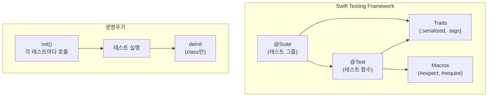
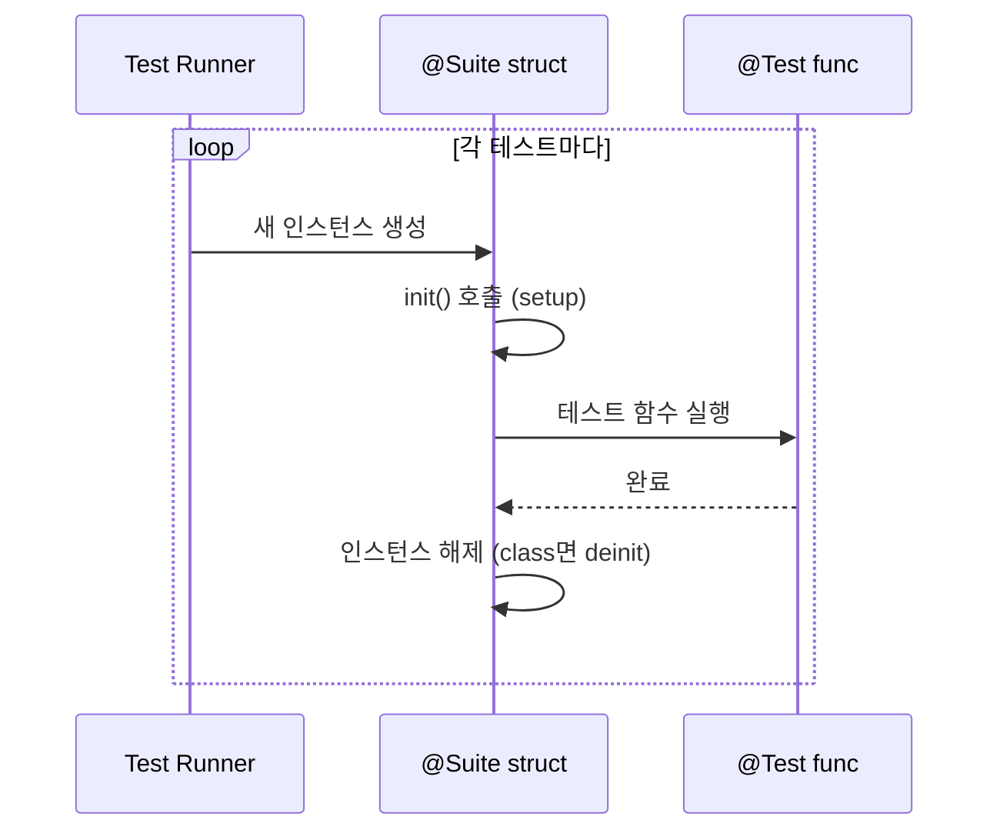

# Swift Testing 프레임워크 가이드

Swift Testing은 Apple의 새로운 테스트 프레임워크로, 매크로 기반의 `@Test`와 `@Suite`를 사용하며 XCTest 대비 더 간결하고 병렬 실행을 기본으로 지원합니다.

## 개념 구조





---

## 1. 생명주기

### 핵심: 테스트마다 새 인스턴스

```swift
@Suite("Todo Tests")
struct TodoTests {
    let repository: TodoRepository

    // ✅ 각 테스트 전에 호출됨 (XCTest의 setUp 역할)
    init() {
        repository = MockTodoRepository()
    }

    @Test func createTodo() { }   // 새 TodoTests 인스턴스
    @Test func deleteTodo() { }   // 또 새 TodoTests 인스턴스
}
```

| 항목 | 동작 |
|------|------|
| `init()` | 각 `@Test` 실행 전에 호출 |
| `deinit` | class일 때만, 각 테스트 후 호출 |
| 인스턴스 공유 | ❌ 없음, 테스트마다 독립 |

### XCTest와 비교

```swift
// XCTest - setUp/tearDown 별도
class MyTests: XCTestCase {
    override func setUp() { }      // 각 테스트 전
    override func tearDown() { }   // 각 테스트 후
}

// Swift Testing - init이 곧 setUp
@Suite struct MyTests {
    init() { }  // setUp 역할
    // tearDown 필요 시 class 사용하고 deinit 활용
}
```

---

## 2. Async/Throws Init

Swift Testing의 `@Suite`는 **`init() async throws`를 지원**합니다.

```swift
@Suite("Firebase Tests")
struct FirebaseTests {
    let repository: TodoRepository

    // ✅ async throws init 지원
    init() async throws {
        try await FirestoreReference.shared.resetAllCollections()
        repository = FirestoreTodoRepository()
    }

    @Test func createTodo() async throws {
        // 테스트 코드
    }
}
```

> [!NOTE]
> 일반 Swift struct에서는 `init() async throws` 불가능하지만,
> Swift Testing의 `@Suite`는 테스트 러너가 async context에서 init을 호출하기 때문에 가능합니다.

---

## 3. 병렬 실행과 테스트 격리

### 기본: 병렬 실행

Swift Testing은 **task group으로 테스트를 병렬 실행**합니다.

```swift
@Suite struct ParallelTests {
    @Test func test1() { }  // ─┐
    @Test func test2() { }  // ─┼─ 동시에 실행될 수 있음
    @Test func test3() { }  // ─┘
}
```

### 직렬 실행이 필요할 때

```swift
// Suite 전체를 직렬화
@Suite(.serialized)
struct DatabaseTests {
    @Test func test1() { }  // 순서대로 실행
    @Test func test2() { }
}

// 또는 개별 테스트만
@Suite struct MixedTests {
    @Test(.serialized) func criticalTest() { }
}
```

> [!WARNING]
> Swift Testing의 병렬 실행은 **파일 단위로도 적용**됩니다.
> 서로 다른 파일에 있는 테스트들도 동시에 실행될 수 있으므로, 테스트 간에 공유되는 글로벌 상태나 외부 자원(데이터베이스, 파일 시스템 등) 접근 시 주의가 필요합니다.


### 테스트 격리

각 테스트마다 **새 인스턴스가 생성**되므로 상태 격리가 자동으로 보장됩니다.

```swift
@Suite struct IsolationDemo {
    var count = 0  // 각 테스트마다 0으로 시작

    @Test mutating func test1() {
        count += 1
        #expect(count == 1)  // ✅ 항상 1
    }

    @Test mutating func test2() {
        count += 1
        #expect(count == 1)  // ✅ 항상 1 (별도 인스턴스)
    }
}
```

---

## 4. Assertions: #expect vs #require

| 매크로 | 실패 시 동작 | 사용 시점 |
|--------|-------------|-----------|
| `#expect` | 계속 진행 | 여러 검증을 한 번에 확인 |
| `#require` | 즉시 중단 | 이후 로직이 의존하는 조건 |

```swift
@Test func assertions() throws {
    let user = User(name: "Alice", age: 25)

    // 실패해도 다음 검증 계속
    #expect(user.name == "Alice")
    #expect(user.age == 25)

    // 실패하면 즉시 중단 (try 필요)
    let profile = try #require(user.profile)
    #expect(profile.bio.count > 0)
}
```

### 에러 검증

```swift
@Test func errorHandling() async {
    await #expect(throws: AuthError.unauthorized) {
        try await login(with: invalidToken)
    }
}
```

---

## 5. Traits 시스템

Traits는 `@Suite`와 `@Test`에 적용되는 실행 속성입니다.

```swift
@Suite(.tags(.integration), .serialized)
struct IntegrationTests {
    @Test(.tags(.slow))
    func longRunningTest() { }

    @Test(.disabled("WIP"))
    func incompleteTest() { }
}
```

| Trait | 설명 |
|-------|------|
| `.serialized` | 직렬 실행 |
| `.tags(.tag)` | 태그로 필터링 |
| `.disabled("reason")` | 테스트 비활성화 |
| `.timeLimit(.minutes(1))` | 시간 제한 |

---

## 6. XCTest vs Swift Testing 비교

| 항목 | XCTest | Swift Testing |
|------|--------|---------------|
| 테스트 정의 | `func test...()` | `@Test func ...()` |
| Assertion | `XCTAssert...` | `#expect`, `#require` |
| Setup | `setUp()` override | `init()` |
| Teardown | `tearDown()` override | `deinit` (class만) |
| 병렬 실행 | 명시적 설정 필요 | 기본 |
| Async Init | ❌ | ✅ |
| Throws Init | ❌ | ✅ |

---

## 7. xcodebuild 테스트 필터링

### 기본 옵션

```bash
xcodebuild test \
    -scheme MyScheme \
    -destination 'platform=macOS' \
    -only-testing:TargetName/TestClassName \
    -skip-testing:TargetName/TestClassName
```

### ⚠️ 주의: 폴더가 아닌 테스트 타입 이름 사용

`-only-testing`과 `-skip-testing`은 **파일 시스템 경로가 아닌 테스트 타입(struct/class) 이름**을 사용합니다.

```bash
# ❌ 잘못된 사용 (폴더 이름)
-skip-testing:TodoMateTests/Firebase

# ✅ 올바른 사용 (테스트 struct 이름)
-skip-testing:TodoMateTests/TodoRepositoryTests
-skip-testing:TodoMateTests/TodoUseCaseTests
```

> [!IMPORTANT]
> 테스트 파일이 `Firebase/TodoRepositoryTests.swift`에 있더라도, 필터링은 `struct TodoRepositoryTests` 이름으로 해야 합니다.

---

## 8. Tag 시스템과 테스트 필터링

Swift Testing의 Tag는 테스트를 논리적으로 그룹화하는 데 유용하지만, **xcodebuild 명령줄에서는 Tag 기반 필터링을 직접 지원하지 않습니다.**

### Tag 정의 및 적용 (Xcode UI용)

```swift
// TestTags.swift
import Testing

extension Tag {
  @Tag static var integration: Self
  @Tag static var slow: Self
}

// 적용
@Suite("Firebase Tests", .tags(.integration))
struct TodoRepositoryTests { }
```

### xcodebuild에서 Tag 필터링 방법

| 방법 | 설명 |
|------|------|
| **Test Plan** | Xcode에서 Test Plan을 생성하고 Tag로 필터링 설정 후 `-testPlan` 옵션 사용 |
| **명시적 지정** | `-only-testing`, `-skip-testing`으로 테스트 클래스명 직접 지정 |
| **Test Target 분리** | Firebase 테스트를 별도 Target으로 분리 |

> [!CAUTION]
> `-test-tag`, `-skip-test-tag` 옵션은 **xcodebuild에 존재하지 않습니다.**

### 현실적인 접근: 명시적 테스트 클래스 지정

```just
# Firebase 테스트 제외
test-unit:
    xcodebuild test \
        -scheme TodoMate \
        -destination 'platform=macOS' \
        -only-testing:TodoMateTests

# Firebase 테스트만 실행 (별도 타겟)
test-integration:
    xcodebuild test \
        -scheme TodoMate \
        -destination 'platform=macOS' \
        -only-testing:TodoMateFirebaseTests
```
