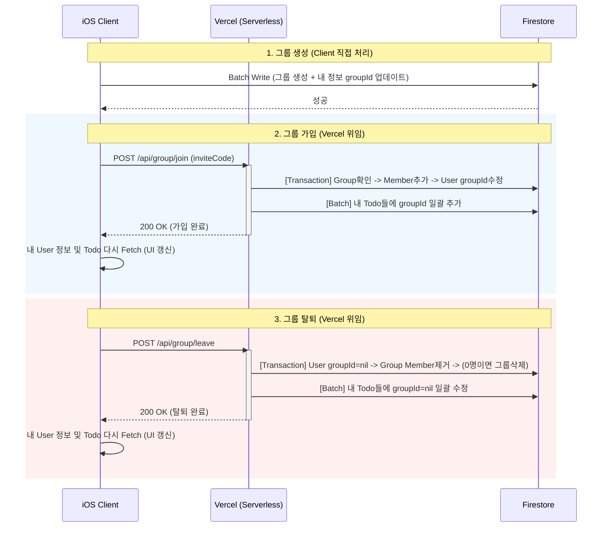

# TodoMate - User, Todo, Group Model

기존에는 Firebase client 측 동작에 의해서만 데이터를 변경했지만, Firebase Cloud Functions를 사용하여 Vercel에서 관리하는 데이터를 변경할 수 있도록 변경한다.

## 1. 핵심 원칙 (Core Principles)

- Read Heavy (조회): 속도와 무료 할당량이 넉넉한 **Client(iOS)**가 Firestore에서 직접 수행한다.
- Write Sensitive (민감한 쓰기): 그룹 가입/탈퇴 등 데이터 정합성이 필요한 작업은 **Vercel(Serverless)**이 firebase-admin으로 수행한다.
- Simple Ownership: 투두는 오직 **생성자(Owner)**만 수정/삭제할 수 있다.
- Denormalization: Todo 문서에 groupId를 포함시켜 쿼리 효율을 극대화한다.

## 2. 데이터 모델 (Data Models)

A. User (Client & Vercel)유저의 기본 정보 및 현재 소속된 그룹 정보를 담는다.

이들은 앱에서 사용하는 Firebase Auth 의 결과 기반으로 회원가입 시(구글로 로그인 -> 최초 회원가입) 생성된다.

```swift
struct User: Codable, Identifiable, Hashable {
    let id: String         // DocumentID (Firebase Auth UID)
    var displayName: String
    var email: String      // 그룹 초대/검색용
    var groupId: String?   // 현재 속한 GroupID (Vercel에 의해서만 변경됨)
    var fcmToken: String?  // 알림용 토큰
    let createdAt: Date
    var updatedAt: Date
}
```

B. Group (Vercel Managed)그룹의 멤버십 정보를 관리한다.


```swift
struct Group: Identifiable, Codable {
    let id: String         // DocumentID
    var name: String
    var memberIds: [String]// 그룹원 UID 목록 (Vercel이 관리)
    let createdAt: Date
    var updatedAt: Date
}
```

C. Todo (Client Managed)groupId 필드를 통해 그룹 필터링을 지원한다.

```swift
struct Todo: Identifiable, Codable {
    let id: String         // DocumentID
    let groupId: String?   // [핵심] 조회 필터용 인덱스. (개인 투두면 nil)

    var content: String
    var status: TodoStatus
    var detail: String
    var date: Date

    let createdAt: Date
    var updatedAt: Date

    let owner: String      // [핵심] 작성자 UID (이 사람만 수정/삭제 가능)

    // Initializer 생략 (위의 대화 내용 참고)
}
```

## 3. 역할 분담 (Role Responsibility)개발 시 로직이 헷갈리면 이 표를 기준 삼는다.

그룹변경에 대해 유저의 Todo에 groupId를 업데이트하는 로직은 Vercel에서 처리하는거라 이해하면 된다(오래걸리는 작업)

| 구분 | 기능(Feature) | 처리 주체 | 구현 방식 |
|---|---|---|---|
| User | 프로필 수정 | Client | Firestore 직접 쓰기 (users/{uid}) |
| Group | 그룹 생성 | Client | Group 생성 -> 내 정보 groupId 업데이트 (Batch Write 권장) |
| Group | 그룹 초대/가입 | Vercel | POST /api/group/join (초대코드 검증 -> Member 추가 -> User 갱신) |
| Group | 그룹 탈퇴/강퇴 | Vercel | POST /api/group/leave (Member 삭제 -> User 갱신) |
| Todo | 투두 생성 | Client | groupId는 내 유저 정보에서 가져와서 저장 |
| Todo | 투두 상태 변경 | Client | owner가 본인일 때만 가능 (Security Rule로 보호) |
| Todo | 투두 조회 | Client | "whereField(""groupId"", ...) 쿼리 사용" |


## 4. 상세 구현 로직 (Implementation Detail)

### [Scenario A] 투두 조회 (Fetching)
복잡한 Loop 없이 단일 쿼리로 해결한다.

내 개인 투두만 보기:

```swift
db.collection("todos")
  .whereField("owner", isEqualTo: currentUid)
```

우리 그룹 투두 전체 보기 (협업 뷰):

```swift
// User 정보에 있는 myGroupId 사용
db.collection("todos")
  .whereField("groupId", isEqualTo: myGroupId)
  .order(by: "date", descending: true) // 이건 아마 오늘날짜에 대해서만 공유할 듯
```

### [Scenario B] 그룹 가입 (Vercel Function)

클라이언트가 DB를 직접 건드리면 Group에는 들어갔는데 User 정보는 안 바뀌는 등 데이터 불일치가 생길 수 있다.
이를 방지하기 위해 서버리스 함수를 쓴다.

요청: POST /api/group/join ({ "uid": "...", "inviteCode": "..." })

서버 로직 (Node.js + firebase-admin):inviteCode로 해당 그룹(targetGroup) 찾기.
Transaction 시작:targetGroup의 memberIds에 uid 추가.
해당 User 문서의 groupId를 targetGroup.id로 업데이트.
성공 시 200 OK 반환.

## 5. 메모

### Firestore Security Rules (보안 규칙)

이 규칙은 firestore.rules 파일에 그대로 적용한다.

```javascript
rules_version = '2';
service cloud.firestore {
  match /databases/{database}/documents {

    // 1. 유저 정보: 본인만 수정 가능, 읽기는 그룹원이면 가능(선택사항)
    match /users/{userId} {
      allow read: if request.auth != null;
      allow write: if request.auth.uid == userId;
      // 주의: groupId 필드는 Vercel(Admin)만 건드릴 수 있게 검증 로직 추가 가능하나,
      // 클라이언트 레벨에서 막는 것으로 1차 방어.
    }

    // 2. 그룹 정보: 읽기는 누구나(혹은 멤버만), 쓰기는 오직 생성자만(생성 시)
    // * 멤버 추가/삭제는 Vercel(Admin SDK)이 하므로 여기선 create만 허용해도 됨.
    match /groups/{groupId} {
      allow read: if request.auth != null;
      allow create: if request.auth != null;
      // update, delete는 Admin SDK(Vercel)를 통해서만 이루어짐 (Rules 우회)
    }

    // 3. 투두: 핵심 로직
    match /todos/{todoId} {
      // 조회: 내꺼거나(owner), 내가 속한 그룹의 글이거나(groupId 일치)
      allow read: if request.auth != null && (
        resource.data.owner == request.auth.uid ||
        resource.data.groupId == get(/databases/$(database)/documents/users/$(request.auth.uid)).data.groupId
      );

      // 생성: 로그인한 유저라면 OK
      allow create: if request.auth != null;

      // 수정/삭제: 오직 작성자(owner) 본인만 가능
      allow update, delete: if request.auth.uid == resource.data.owner;
    }
  }
}
```

### Cloud function 사용 설정

- Firebase Console: 프로젝트 생성 및 Service Account Key 다운로드 (Vercel용).
- Client (Swift): 위 데이터 모델(User, Group, Todo) 파일 생성.
- Client (Swift): Todo 생성 시 groupId가 올바르게 들어가는지 확인.
- Vercel: Node.js 프로젝트 생성 -> firebase-admin 설치 -> 환경변수 설정 -> /api/join 등 함수 배포.
- Firebase Console: 위 Security Rules 복사/붙여넣기 후 게시.

### 실제 케이스별 수행

Group Logic (Create / Join / Leave)



1. 그룹 생성 (Client 직접)

```
이건 네 말대로 트랜잭션 필요 없이 Client에서 Batch Write로 끝낸다. 실패하면 둘 다 안 생기니 안전하다.

Action:

Group 문서 생성 (memberIds: [myUid])

User 문서 업데이트 (groupId: newGroupId)

commit()

```

2. 그룹 가입 (POST /api/group/join)

```
User가 할 일: 초대 코드 입력 후 "가입" 버튼 누르면 Vercel API 호출 -> 로딩 표시 -> 응답 오면 새로고침.

Vercel 로직:

검증: 초대 코드로 Group 찾기. (없으면 에러)

트랜잭션 (DB 정합성):

Group.memberIds에 내 uid 추가.

User.groupId에 targetGroupId 업데이트.

후속 작업 (Todo 마이그레이션):

네가 말한 **"Todo들에 groupId 추가"**는 클라이언트보다 **서버(Vercel)**가 하는 게 낫다.

todos 컬렉션에서 owner == myUid인 문서들을 쿼리해서, groupId 필드를 일괄 업데이트(Batch) 한다. (문서가 많으면 500개씩 끊어서 처리)

응답: 200 OK.
```

3. 그룹 탈퇴 (POST /api/group/leave)

```
User가 할 일: "탈퇴" 버튼 -> Vercel API 호출.

Vercel 로직:

트랜잭션:

User.groupId를 nil로 변경.

Group.memberIds에서 내 uid 제거.

체크: 제거 후 memberIds 개수가 0이면? -> Group 문서 삭제 (Delete).

후속 작업 (Todo 정리):

todos 컬렉션에서 owner == myUid인 문서들을 찾아 groupId 필드를 nil로 업데이트.

응답: 200 OK.
```
