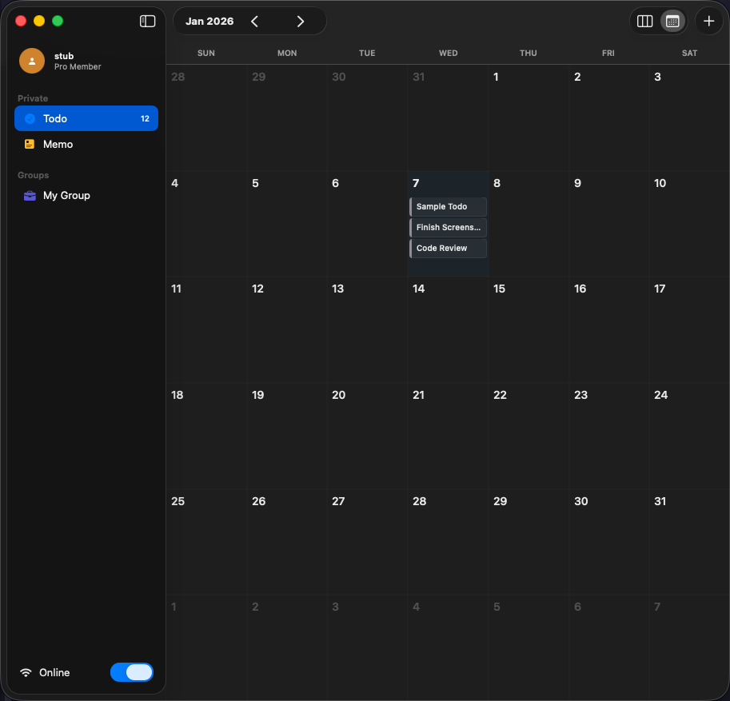
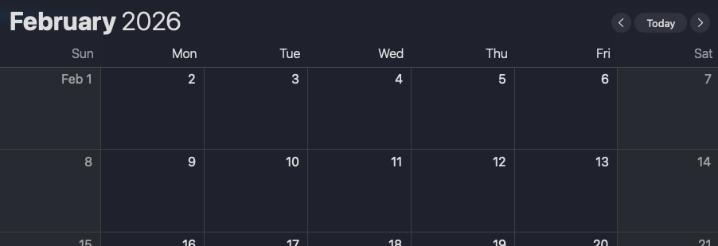

# Home Calendar 기능 개선

## 개요
Personal Calendar 화면의 헤더 디자인 리팩토링 및 UI 개선

---

## 참고 이미지

| 현재 | 목표 |
|------|------|
|  |  |

---

## 변경 사항

### 1. 날짜 헤더 위치 변경
- **현재**: Toolbar에 `calendarHeader` 배치 (`Jan 2026 < >`)
- **변경**: 뷰 본문 상단 헤더로 이동
- **레이아웃**:
  ```
  ┌──────────────────────────────────────────────────┐
  │ January 2026  [<] [Today] [>]                    │  ← 뷰 헤더 (toolbar X)
  │                                                 │
  │ Sun  Mon  Tue  Wed  Thu  Fri  Sat                │  ← weekdayHeader
  ├──────────────────────────────────────────────────┤
  │ 날짜 셀들...                                      │
  └──────────────────────────────────────────────────┘
  ```

### 2. 달 이동 버튼 + Today 버튼
- **현재**: `< >` 버튼만 있음
- **변경**:
  - 날짜 텍스트 바로 옆에 `< Today >` 버튼 배치
  - `Today` 클릭 시 오늘 날짜로 이동
- **구현**:
  ```swift
  HStack {
    Text(currentDate.formatted(.dateTime.month(.wide).year()))
      .font(.title2.bold())

    HStack(spacing: 8) {
      Button { previousMonth() } label: {
        Image(systemName: "chevron.left")
      }
      Button("Today") { currentDate = Date() }
      Button { nextMonth() } label: {
        Image(systemName: "chevron.right")
      }
    }
    .buttonStyle(.bordered)
  }
  ```

### 3. Weekday 헤더 배경 통일
- **현재**: `Color.secondary.opacity(0.05)` 배경 → toolbar까지 색상 전염
- **변경**: 배경 제거, 날짜 셀과 동일하게 (구분선만 유지)
- **영향**: `weekdayHeader` 수정
  ```swift
  // Before
  .background(Color.secondary.opacity(0.05))

  // After
  .background(Color.clear)  // 또는 제거
  ```


### 4. TodoSheet → TodoStore 캐시 연동 (공통)
- `home-board.md` 항목 4와 동일
- `TodoSheet`에서 Add/Update 시 `TodoStore` 통해 처리

---

## 검증 계획

### 수동 검증
- [ ] 헤더가 뷰 본문에 표시 (toolbar 아님)
- [ ] weekday 배경이 셀과 동일 (색상 전염 없음)
- [ ] 스크린샷 비교 (변경 전/후)
