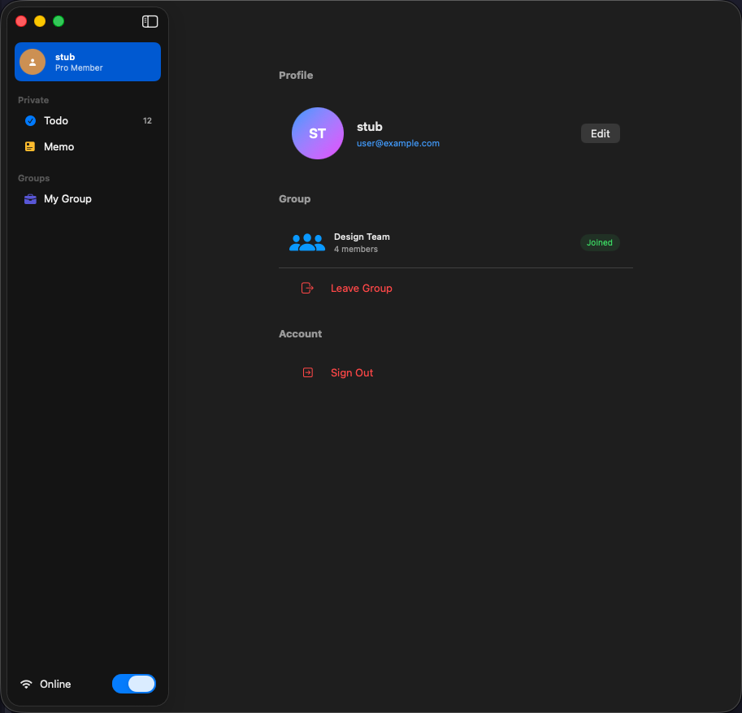

# Profile/Settings 기능 개선

## 개요
Settings 화면의 프로필 이미지, 그룹 정보 동적화 및 섹션명 변경

---

## 참고 이미지



---

## 변경 사항

### 1. 프로필 이미지 동적 생성 ✅ (이미 구현됨)
- **현재**: `displayName` 앞 2글자 기반 그라데이션 이미지 (구현 완료)
- **확인**: `SettingView.swift:74-88`
  ```swift
  Circle()
    .fill(LinearGradient(colors: [.blue, .purple], ...))
    .overlay(
  Text(displayName.prefix(1).uppercased())
)
  ```
- **Sidebar 연동**: Sidebar 프로필도 동일 스타일로 통일 필요

### 2. Sidebar 프로필 이미지 통일
- **현재**: Sidebar 프로필 이미지가 Settings와 다를 수 있음
- **변경**: Settings와 동일한 그라데이션 + 이니셜 스타일로 통일
- **구현**: 공통 `ProfileAvatarView` 컴포넌트 추출

### 3. 그룹 정보 동적화
- **현재**: 하드코딩된 값들
  - `"Design Team"` (SettingView.swift:129)
  - `"4 members"` (SettingView.swift:132)
- **변경**: `SessionStore`에서 실제 그룹 정보 표시
  - 그룹 있음: 그룹 ID + 멤버 수 표시
  - 그룹 없음: "그룹 없음" 표시, Leave 버튼 숨김
- **구현**:
  ```swift
  if let group = sessionStore.currentGroup {
    Text(group.id)
    Text("\(group.memberIds.count) members")
  } else {
    Text("그룹 없음")
      .foregroundStyle(.secondary)
  }
  ```

### 4. 섹션명 변경
- **현재**: `"Account"` (SettingView.swift:176)
- **변경**: `"App"`
- **영향**: 단순 텍스트 변경

### 5. Display Name 수정 기능 추가
- **개요**: 사용자가 자신의 이름을 수정할 수 있어야 함
- **조건**:
  - 이름은 비어있을 수 없음 (`!isEmpty`)
  - 최대 글자 수 제한 (예: 20자)
  - 수정 시 즉시 반영 (Sidebar 프로필 뱃지 등)
- **구현**:
  - **Domain**: `UpdateUserUseCase` 추가 및 검증 로직 구현
  - **Entity**: `User` 엔티티 유효성 검사 (UseCase 단에서 처리 가능)
  - **UI**: Settings 화면에서 이름 클릭 시 수정 시트 또는 인라인 편집 제공
  - **Store**: `SessionStore`를 통해 UseCase 호출 및 로컬 상태 업데이트
- **검증**: UseCase Unit Test 작성 (유효하지 않은 이름 처리 등)
### 6. 그룹 탈퇴 (Leave Group) 기능 추가
- **개요**: 사용자가 현재 속한 그룹에서 탈퇴할 수 있어야 함
- **조건**:
  - 그룹에 속해있을 때만 "Leave" 버튼 활성화
  - 탈퇴 시 확인 팝업 (Alert) 표시
  - 탈퇴 성공 시:
    - `group_id` 초기화 (nil 또는 빈 값)
    - Sidebar의 "My Group" 섹션이 "No Groups Joined"로 즉시 변경되어야 함
- **구현**:
  - **Domain**: `LeaveGroupUseCase` 정의 및 구현
  - **UI**: Settings 화면의 "Leave" 버튼에 액션 연결
  - **Store**: `SessionStore`에 `leaveGroup()` 메서드 추가 및 상태 업데이트
- **검증**: UseCase Unit Test 작성 (성공/실패 케이스)


---

## 검증 계획

### 수동 검증
- [ ] 프로필 이미지가 displayName 앞글자 기반으로 표시
- [ ] Sidebar 프로필 이미지가 Settings와 동일
- [ ] 그룹 있을 때: 그룹 ID + 멤버 수 표시
- [ ] 그룹 없을 때: "그룹 없음" 표시, Leave 버튼 숨김
- [ ] 섹션명이 "App"으로 표시
- [ ] Display Name 수정 시:
    - 빈 문자열 입력 시 저장 불가 (버튼 비활성화 또는 에러 메시지)
    - 유효한 이름 변경 시 Settings 및 Sidebar 프로필 이름/아바타 즉시 업데이트

### 자동화 테스트 (Unit)
- [ ] `UpdateUserUseCase` 검증
    - 유효한 이름 업데이트 성공
    - 빈 이름 업데이트 실패 (Error throw)
    - 글자 수 초과 처리 확인
