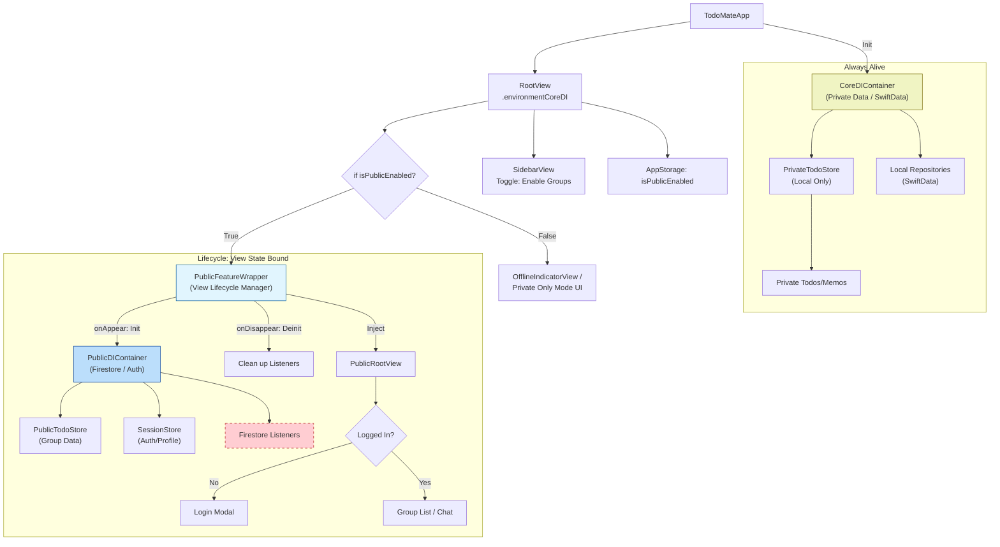

# [Refactor] 오프라인 코어 및 Public 기능 분리

## 목표
애플리케이션 아키텍처를 "Private/Local(개인/로컬)" 기능과 "Public/Remote(공유/원격)" 기능으로 엄격하게 분리하여, 강력한 오프라인 모드를 지원하고 메모리 사용량을 최적화합니다.

- **Private Context (Core)**: 항상 활성화됨. 로컬 디스크(SwiftData)만 사용. 가볍고 빠름.
- **Public Context (Feature)**: 사이드바 토글을 통해 활성화된 경우에만 로드됨. Firebase(Firestore, Auth) 사용. 리소스를 많이 사용하는 객체(리스너, 네트워크 연결 등)는 필요할 때만 할당하고 토글 Off 시 즉시 해제함.

## 아키텍처 구조

기존의 모놀리식 DIContainer 구조에서 Core(필수) + Optional Public(선택) 구조로 전환합니다.

## 구현 전략

0.  **Monolith First**: 우선 별도의 SPM 패키지로 분리하지 않고, 메인 App Target 내에서 논리적으로만 분리하여 구현합니다. (패키지 분리는 추후 진행)

1.  **Toggle Lifecycle Control**: "Public 모드" 토글은 `@AppStorage`로 간편하게 관리합니다.
2.  **View-Driven Lifecycle**:
    - 별도의 복잡한 Reference Counting 로직 없이, SwiftUI 뷰의 `if-else` 분기와 `onAppear/onDisappear`를 통해 `PublicDIContainer`의 생명주기를 관리합니다.
    - 토글 ON -> `PublicFeatureWrapper` 뷰 생성 -> `init` -> `PublicDIContainer` 생성 및 연결.
    - 토글 OFF -> `PublicFeatureWrapper` 뷰 파괴 -> `deinit` -> 리스너 및 리소스 해제.
3.  **Strict Isolation**: `CoreDIContainer`는 절대로 Firebase 모듈을 import하거나 `AuthService`를 참조해서는 안 됩니다.
모든 Firebase 관련 의존성(Repositories, UseCases, Stores)은 반드시 `PublicDIContainer` 내부로 이동시켜야 합니다.

## 상세 작업 목록

### Phase 1: 의존성 주입(DI) 리팩토링 [DONE]
- [x] **`CoreDIContainer` 정의**
    - [x] 로컬 전용 의존성 식별 및 이동:
        - `UserDefaults`
        - `CalendarDayService`
    - [ ] 로컬 Repository 등록 (SwiftData 구현체 - Phase 4 예정)
    - [ ] Core UseCases 등록

- [x] **`PublicDIContainer` 정의**
    - [x] Firebase/Remote 의존성 이동:
        - `AuthService`
        - `UserRepository`, `FirebaseTodoRepository`, `GroupRepository`, `MessageRepository`
    - [x] Public UseCases 등록:
        - `SignInUseCase`, `CreateRemoteTodoUseCase`, `ReadGroupUseCase` 등
    - [x] **중요**: `init()` 시점에 리스너 등록 후 `cleanup()` 메서드를 통해 명시적으로 해제되도록 관리 (구현 완료).

- [x] **`AppDIContainer` 정의**
    - [x] `CoreDIContainer`와 `PublicDIContainer?`를 담는 최상위 컨테이너 구현.
    - [x] UI Test용 Mocking 지원 (`AppDIContainer+Mocks.swift`).

### Phase 2: 뷰 계층 및 수명주기(Lifecycle) [DONE]
- [x] **모드 토글 상태 관리**
    - [x] `AppStorage("isPublicModeEnabled")`를 사용하여 상태 관리 (`RootView`).
    - [x] 사이드바에 네트워크 토글 UI 배치 (`SidebarView`).

- [x] **`PublicFeatureWrapper` 뷰 구현**
    - [x] `@State`로 `PublicDIContainer` 및 Store들을 관리하는 Wrapper 뷰 구현.
    - [x] **Lifecycle**:
        - `init`: `PublicDIContainer` 및 Store들 생성 (Firebase 서비스 준비).
        - `body`: 하위 뷰에 `environment` 주입.
        - `onDisappear`: Store들의 `cleanup()` 호출 및 리소스 해제 로그 확인.

- [x] **`Default / Offline` UI 처리**
    - [x] `OfflinePlaceholderView` 구현: 오프라인 모드 진입 시 표시되는 안내 UI.
    - [x] `RootView`에서 토글 상태에 따른 분기 처리 구현.

### Phase 3: 스토어 및 데이터 리팩토링 [DONE]
- [x] **스토어 분리 및 정리**
    - [x] `SessionStore`, `TodoStore` 등을 `PublicFeatureWrapper` 내부로 격리.
    - [x] `PrivateTodoStore` 신설: SwiftData 기반 개인용 데이터 관리 (프로토타입 구현 완료).
- [x] **Data layer 분리**
    - [x] `CoreDI`에는 Firebase 의존성이 없는 Repository만 존재하도록 보장.

### Phase 4: 데이터 계층 구현 (SwiftData 준비) [DONE]
- [x] **로컬 Repository 구현**
    - [x] `LocalTodoRepository` 생성 및 SwiftData 기본 CRUD 연결.
    - [x] `SDTodo` 모델 정의 및 `Todo` 엔티티 매핑 구현.
    - [x] `CoreDIContainer`에 `modelContext` 주입 및 Repository 등록.

## 검증 체크리스트
- [x] **View 생명주기 검증**: 토글 ON/OFF 반복 시 `PublicDIContainer` 관련 로그 확인 (`init`/`cleaned up`).
- [ ] **메모리 누수 테스트**: 토글 OFF 시 관련 객체가 메모리에서 해제되는지 Instruments로 확인 필요.
- [x] **오프라인 실행 테스트**: 토글 OFF 상태에서 `OfflinePlaceholderView` 정상 진입 확인.
- [x] **CoreDI 격리 확인**: `CoreDIContainer.swift` 파일에서 Firebase import 제거 완료.
