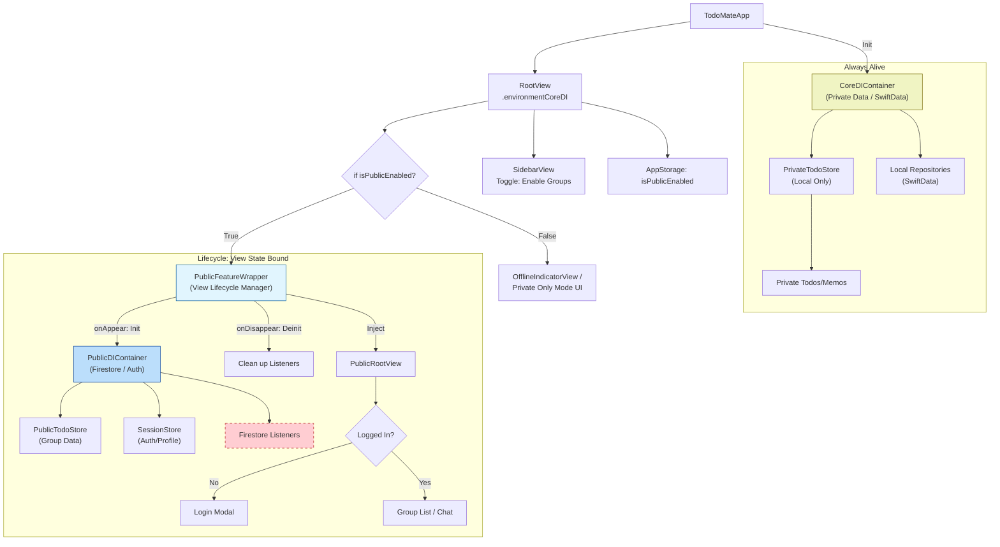

# [Refactor] 오프라인 코어 및 Public 기능 분리

## 목표
애플리케이션 아키텍처를 "Private/Local(개인/로컬)" 기능과 "Public/Remote(공유/원격)" 기능으로 엄격하게 분리하여, 강력한 오프라인 모드를 지원하고 메모리 사용량을 최적화합니다.

- **Private Context (Core)**: 항상 활성화됨. 로컬 디스크(SwiftData)만 사용. 가볍고 빠름.
- **Public Context (Feature)**: 사이드바 토글을 통해 활성화된 경우에만 로드됨. Firebase(Firestore, Auth) 사용. 리소스를 많이 사용하는 객체(리스너, 네트워크 연결 등)는 필요할 때만 할당하고 토글 Off 시 즉시 해제함.

## 아키텍처 구조

기존의 모놀리식 DIContainer 구조에서 Core(필수) + Optional Public(선택) 구조로 전환합니다.

## 구현 전략

0.  **Monolith First**: 우선 별도의 SPM 패키지로 분리하지 않고, 메인 App Target 내에서 논리적으로만 분리하여 구현합니다. (패키지 분리는 추후 진행)

1.  **Toggle Lifecycle Control**: "Public 모드" 토글은 `@AppStorage`로 간편하게 관리합니다.
2.  **View-Driven Lifecycle**:
    - 별도의 복잡한 Reference Counting 로직 없이, SwiftUI 뷰의 `if-else` 분기와 `onAppear/onDisappear`를 통해 `PublicDIContainer`의 생명주기를 관리합니다.
    - 토글 ON -> `PublicFeatureWrapper` 뷰 생성 -> `init` -> `PublicDIContainer` 생성 및 연결.
    - 토글 OFF -> `PublicFeatureWrapper` 뷰 파괴 -> `deinit` -> 리스너 및 리소스 해제.
3.  **Strict Isolation**: `CoreDIContainer`는 절대로 Firebase 모듈을 import하거나 `AuthService`를 참조해서는 안 됩니다.
모든 Firebase 관련 의존성(Repositories, UseCases, Stores)은 반드시 `PublicDIContainer` 내부로 이동시켜야 합니다.

## 상세 작업 목록

### Phase 1: 의존성 주입(DI) 리팩토링
- [ ] **`CoreDIContainer` 정의**
    - [ ] 로컬 전용 의존성 식별 및 이동:
        - `UserDefaults`
        - `CalendarDayService`
    - [ ] 로컬 Repository 등록 (Placeholder 또는 SwiftData 구현체):
        - `LocalTodoRepository`
        - `LocalMemoRepository`
    - [ ] Core UseCases 등록:
        - `CreateLocalTodoUseCase`, `ReadLocalTodoUseCase` 등

- [ ] **`PublicDIContainer` 정의**
    - [ ] Firebase/Remote 의존성 이동:
        - `AuthService`
        - `UserRepository`, `FirebaseTodoRepository`, `GroupRepository`, `MessageRepository`
    - [ ] Public UseCases 등록:
        - `SignInUseCase`, `CreateRemoteTodoUseCase`, `ReadGroupUseCase` 등
    - [ ] **중요**: `init()` 시점에 필요한 리스너가 있다면 등록하고, `deinit` 시점에 확실하게 해제되도록 관리해야 함.

### Phase 2: 뷰 계층 및 수명주기(Lifecycle)
- [ ] **모드 토글 상태 관리**
    - [ ] `AppStorage("isPublicModeEnabled")` 등을 사용하여 간단하게 상태 관리.
    - [ ] 사이드바 또는 설정에 토글 UI 배치.

- [ ] **`PublicFeatureWrapper` 뷰 구현**
    - [ ] `StateObject` 또는 `@State`로 `PublicDIContainer`를 관리하는 Wrapper 뷰.
    - [ ] 조건: `if isPublicModeEnabled { PublicFeatureWrapper() }`
    - [ ] **Lifecycle**:
        - `init`: `PublicDIContainer` 생성 (Firebase 연결 시작).
        - `body`: 하위 뷰에 `environment(publicDI)` 주입.
        - 뷰가 사라질 때(토글 OFF) 자연스럽게 `deinit` 호출되며 리소스 해제.

- [ ] **`Default / Offline` UI 처리**
    - [ ] 토글이 꺼져 있을 때 보여줄 플레이스홀더 또는 "오프라인/개인 모드 안내" UI 구현.
    - [ ] 사이드바의 "Group" 섹션이 숨겨지거나, 비활성화 상태임을 표시.

### Phase 3: 스토어 및 데이터 리팩토링
- [ ] **`TodoStore` 분리**
    - [ ] `PrivateTodoStore`: "나의 할 일" (로컬) 관리. `CoreDI` 주입.
    - [ ] `PublicTodoStore`: "그룹 할 일" (공유) 관리. `PublicDI` 주입.
- [ ] **`SessionStore` 격리**
    - [ ] `SessionStore`를 `PublicDI`의 하위 요소로 이동.
    - [ ] `SessionStore` 없이도 앱이 실행될 수 있어야 함.

### Phase 4: 데이터 계층 구현 (SwiftData 준비)
- [ ] **로컬 Repository 구현**
    - [ ] `LocalTodoRepository` 생성 및 SwiftData 기본 CRUD 연결.
    - [ ] 기존 Firebase 의존 코드 제거 및 분리.

## 검증 체크리스트
- [ ] **View 생명주기 검증**: 토글 ON/OFF 반복 시 `PublicDIContainer`의 `init`/`deinit`이 정확히 호출되는지 로그 확인.
- [ ] **메모리 누수 테스트**: 토글 OFF 시 관련 객체(Firestore 리스너, Store 등)가 힙 메모리에서 완전히 사라지는지 확인.
- [ ] **오프라인 실행 테스트**: WiFi 끄고 앱 실행 -> 토글 OFF 상태에서 앱 정상 작동 확인.
- [ ] **CoreDI 격리 확인**: `CoreDIContainer` 파일에 `import Firebase` 구문이 없는지 확인.
